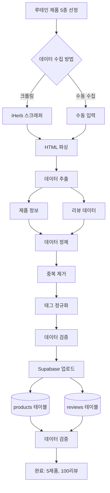

# 팀원 A: 데이터 수집 및 DB 구축 담당 가이드

## 📋 역할 개요

**목표:** "루테인 제품 5종의 리뷰 데이터를 수집하여 Supabase에 저장한다."

iHerb에서 루테인 제품 5종을 선정하고, 각 제품당 20개의 리뷰(총 100개)를 수집하여 Supabase 데이터베이스에 저장하는 **1회성 작업**을 담당합니다.

---

## 🎯 상세 미션

### 1. 제품 선정 및 데이터 수집
- iHerb에서 루테인 제품 5종 선정
- 각 제품당 리뷰 20개 수집 (크롤링 또는 수동)
- 제품 정보 및 리뷰 메타데이터 추출

### 2. 데이터 정제
- 중복 리뷰 제거
- 특수문자 및 불필요한 공백 정리
- 태그 정규화 (재구매, 한달사용 등)

### 3. Supabase DB 구축
- 테이블 설계 (products, reviews)
- 데이터 업로드 스크립트 작성
- 데이터 무결성 검증

---

## 🏗️ 시스템 아키텍처



---

## 📁 파일 구조

```
data_manager/
├── __init__.py              # 패키지 초기화
├── scraper.py               # iHerb 스크래퍼 (선택적 사용)
│   └── IHerbScraper         # iHerb 리뷰 크롤러
├── data_cleaner.py          # 데이터 정제 모듈
│   ├── ReviewCleaner        # 리뷰 정제 클래스
│   └── TagNormalizer        # 태그 정규화 클래스
├── supabase_client.py       # Supabase 클라이언트
│   └── SupabaseClient       # DB 연결 및 CRUD
├── db_uploader.py           # DB 업로드 스크립트
│   └── upload_all_data()    # 메인 업로드 함수
└── config.py                # 설정 파일
    ├── SUPABASE_CONFIG      # Supabase 설정
    └── PRODUCTS_LIST        # 수집 대상 제품 목록
```

---

## 🔧 기술 스택

- **웹 스크래핑 (선택적):**
  - `selenium` (4.15.0+): 동적 페이지 처리
  - `beautifulsoup4` (4.12.0+): HTML 파싱
  - `requests` (2.31.0+): HTTP 요청

- **데이터베이스:**
  - `supabase` (2.0.0+): Supabase Python 클라이언트

- **데이터 처리:**
  - `pandas` (2.0.0+): 데이터 조작
  - `python-dotenv` (1.0.0+): 환경 변수 관리

---

## 📊 Supabase 테이블 설계

### products 테이블
```sql
CREATE TABLE products (
    id UUID PRIMARY KEY DEFAULT gen_random_uuid(),
    name VARCHAR(255) NOT NULL,
    brand VARCHAR(255),
    price DECIMAL(10, 2),
    serving_size VARCHAR(100),
    servings_per_container INTEGER,
    ingredients JSONB,           -- [{name, amount, daily_value}]
    other_ingredients TEXT[],
    warnings TEXT[],
    product_url TEXT,
    image_url TEXT,
    created_at TIMESTAMP DEFAULT NOW()
);
```

### reviews 테이블
```sql
CREATE TABLE reviews (
    id UUID PRIMARY KEY DEFAULT gen_random_uuid(),
    product_id UUID REFERENCES products(id) ON DELETE CASCADE,
    text TEXT NOT NULL,
    rating INTEGER CHECK (rating >= 1 AND rating <= 5),
    date DATE,
    reorder BOOLEAN DEFAULT FALSE,
    one_month_use BOOLEAN DEFAULT FALSE,
    reviewer VARCHAR(255),
    verified BOOLEAN DEFAULT FALSE,
    helpful_count INTEGER DEFAULT 0,
    created_at TIMESTAMP DEFAULT NOW()
);

-- 인덱스 추가
CREATE INDEX idx_reviews_product_id ON reviews(product_id);
CREATE INDEX idx_reviews_rating ON reviews(rating);
```

---

## 📝 주요 클래스 및 함수 설계

### 1. `supabase_client.py`

```python
# data_manager/supabase_client.py
import os
from supabase import create_client, Client
from dotenv import load_dotenv
from typing import List, Dict, Optional

load_dotenv()

class SupabaseClient:
    """Supabase 데이터베이스 클라이언트"""

    def __init__(self):
        url = os.getenv("SUPABASE_URL")
        key = os.getenv("SUPABASE_KEY")
        self.client: Client = create_client(url, key)

    def insert_product(self, product: Dict) -> Dict:
        """
        제품 정보 저장

        Args:
            product: {
                'name': str,
                'brand': str,
                'price': float,
                'serving_size': str,
                'servings_per_container': int,
                'ingredients': List[Dict],
                'other_ingredients': List[str],
                'warnings': List[str],
                'product_url': str,
                'image_url': str
            }

        Returns:
            Dict: 저장된 제품 데이터 (id 포함)
        """
        response = self.client.table('products').insert(product).execute()
        return response.data[0]

    def insert_reviews(self, reviews: List[Dict]) -> List[Dict]:
        """
        리뷰 일괄 저장

        Args:
            reviews: 리뷰 리스트 (product_id 포함)

        Returns:
            List[Dict]: 저장된 리뷰 데이터
        """
        response = self.client.table('reviews').insert(reviews).execute()
        return response.data

    def get_all_products(self) -> List[Dict]:
        """전체 제품 목록 조회"""
        response = self.client.table('products').select('*').execute()
        return response.data

    def get_reviews_by_product(self, product_id: str) -> List[Dict]:
        """제품별 리뷰 조회"""
        response = self.client.table('reviews')\
            .select('*')\
            .eq('product_id', product_id)\
            .execute()
        return response.data

    def search_products(self, keyword: str) -> List[Dict]:
        """제품 검색 (이름 기준)"""
        response = self.client.table('products')\
            .select('*')\
            .ilike('name', f'%{keyword}%')\
            .execute()
        return response.data
```

### 2. `scraper.py` (선택적 사용)

```python
# data_manager/scraper.py
from abc import ABC, abstractmethod
from typing import List, Dict
from selenium import webdriver
from selenium.webdriver.common.by import By
from selenium.webdriver.support.ui import WebDriverWait
from selenium.webdriver.support import expected_conditions as EC
from bs4 import BeautifulSoup
import time

class IHerbScraper:
    """iHerb 리뷰 스크래퍼"""

    def __init__(self, url: str, max_reviews: int = 20):
        self.url = url
        self.max_reviews = max_reviews
        self.driver = None

    def scrape(self) -> Dict:
        """
        iHerb 제품 정보 및 리뷰 수집

        Returns:
            Dict: {
                'product': {...},
                'reviews': [...]
            }
        """
        try:
            self._setup_driver()
            self.driver.get(self.url)
            time.sleep(3)  # 페이지 로딩 대기

            product = self._parse_product()
            reviews = self._parse_reviews()

            return {
                'product': product,
                'reviews': reviews[:self.max_reviews]
            }
        finally:
            self._close_driver()

    def _setup_driver(self):
        """Selenium 드라이버 설정"""
        options = webdriver.ChromeOptions()
        options.add_argument('--headless')
        options.add_argument('--no-sandbox')
        options.add_argument('--disable-dev-shm-usage')
        self.driver = webdriver.Chrome(options=options)

    def _close_driver(self):
        """드라이버 종료"""
        if self.driver:
            self.driver.quit()

    def _parse_product(self) -> Dict:
        """제품 정보 파싱"""
        soup = BeautifulSoup(self.driver.page_source, 'html.parser')

        # iHerb 페이지 구조에 맞게 수정 필요
        return {
            'name': self._get_text(soup, '.product-title'),
            'brand': self._get_text(soup, '.brand-name'),
            'price': self._parse_price(soup),
            'serving_size': '',
            'servings_per_container': 0,
            'ingredients': [],
            'other_ingredients': [],
            'warnings': [],
            'product_url': self.url,
            'image_url': ''
        }

    def _parse_reviews(self) -> List[Dict]:
        """리뷰 파싱"""
        reviews = []
        # 리뷰 섹션으로 스크롤
        # 실제 iHerb 구조에 맞게 구현
        return reviews

    def _get_text(self, soup, selector: str) -> str:
        """안전하게 텍스트 추출"""
        element = soup.select_one(selector)
        return element.text.strip() if element else ''

    def _parse_price(self, soup) -> float:
        """가격 파싱"""
        # 실제 구현
        return 0.0
```

### 3. `data_cleaner.py`

```python
# data_manager/data_cleaner.py
import re
from typing import List, Dict

class ReviewCleaner:
    """리뷰 데이터 정제 클래스"""

    def clean(self, reviews: List[Dict]) -> List[Dict]:
        """리뷰 데이터 정제"""
        cleaned = []
        seen_texts = set()

        for review in reviews:
            # 중복 제거
            text = review.get('text', '').strip()
            if not text or text in seen_texts:
                continue
            seen_texts.add(text)

            # 텍스트 정제
            review['text'] = self.clean_text(text)

            # 유효성 검사
            if self.validate_review(review):
                cleaned.append(review)

        return cleaned

    def clean_text(self, text: str) -> str:
        """텍스트 정제"""
        # 불필요한 공백 제거
        text = re.sub(r'\s+', ' ', text)
        # HTML 태그 제거
        text = re.sub(r'<[^>]+>', '', text)
        return text.strip()

    def validate_review(self, review: Dict) -> bool:
        """리뷰 유효성 검사"""
        return (
            review.get('text') and
            len(review.get('text', '')) >= 10 and  # 최소 길이
            review.get('rating') is not None and
            1 <= review.get('rating', 0) <= 5
        )


class TagNormalizer:
    """태그 정규화 클래스"""

    # 재구매 관련 키워드
    REORDER_KEYWORDS = [
        'reorder', 'repurchase', 'buy again', 'order again',
        '재구매', '또 살', '다시 구매'
    ]

    # 장기 사용 관련 키워드
    LONG_USE_KEYWORDS = [
        'month', 'months', 'year', 'years', 'long time',
        '한달', '1달', '몇달', '개월', '오래'
    ]

    def normalize(self, reviews: List[Dict]) -> List[Dict]:
        """태그 정보 정규화"""
        for review in reviews:
            text = review.get('text', '').lower()
            review['reorder'] = self._check_reorder(text, review)
            review['one_month_use'] = self._check_long_use(text, review)
        return reviews

    def _check_reorder(self, text: str, review: Dict) -> bool:
        """재구매 태그 확인"""
        # 기존 태그가 있으면 사용
        if review.get('reorder') is not None:
            return review['reorder']
        # 텍스트에서 키워드 검색
        return any(kw in text for kw in self.REORDER_KEYWORDS)

    def _check_long_use(self, text: str, review: Dict) -> bool:
        """장기 사용 태그 확인"""
        if review.get('one_month_use') is not None:
            return review['one_month_use']
        return any(kw in text for kw in self.LONG_USE_KEYWORDS)
```

### 4. `db_uploader.py`

```python
# data_manager/db_uploader.py
from typing import List, Dict
from .supabase_client import SupabaseClient
from .data_cleaner import ReviewCleaner, TagNormalizer

def upload_product_with_reviews(
    client: SupabaseClient,
    product_data: Dict,
    reviews_data: List[Dict]
) -> Dict:
    """
    제품과 리뷰를 함께 업로드

    Args:
        client: Supabase 클라이언트
        product_data: 제품 정보
        reviews_data: 리뷰 리스트

    Returns:
        Dict: 업로드 결과
    """
    # 데이터 정제
    cleaner = ReviewCleaner()
    normalizer = TagNormalizer()

    cleaned_reviews = cleaner.clean(reviews_data)
    normalized_reviews = normalizer.normalize(cleaned_reviews)

    # 제품 저장
    saved_product = client.insert_product(product_data)
    product_id = saved_product['id']

    # 리뷰에 product_id 추가
    for review in normalized_reviews:
        review['product_id'] = product_id

    # 리뷰 저장
    saved_reviews = client.insert_reviews(normalized_reviews)

    return {
        'product': saved_product,
        'reviews_count': len(saved_reviews)
    }


def upload_all_data():
    """
    전체 데이터 업로드 메인 함수

    5개 제품, 각 20개 리뷰 = 총 100개 리뷰 업로드
    """
    client = SupabaseClient()

    # 예시 데이터 (실제로는 크롤링 또는 수동 수집한 데이터 사용)
    products_data = [
        {
            'product': {
                'name': 'Lutein 20mg with Zeaxanthin',
                'brand': 'NOW Foods',
                'price': 15.99,
                'serving_size': '1 softgel',
                'servings_per_container': 90,
                'ingredients': [
                    {'name': 'Lutein', 'amount': '20mg', 'daily_value': '*'},
                    {'name': 'Zeaxanthin', 'amount': '1mg', 'daily_value': '*'}
                ],
                'other_ingredients': ['Softgel Capsule', 'Rice Bran Oil'],
                'warnings': ['Keep out of reach of children'],
                'product_url': 'https://www.iherb.com/pr/...',
                'image_url': ''
            },
            'reviews': [
                # 20개 리뷰 데이터
            ]
        },
        # 나머지 4개 제품...
    ]

    results = []
    for data in products_data:
        result = upload_product_with_reviews(
            client,
            data['product'],
            data['reviews']
        )
        results.append(result)
        print(f"✅ {result['product']['name']}: {result['reviews_count']}개 리뷰 업로드 완료")

    print(f"\n🎉 전체 업로드 완료: {len(results)}개 제품")
    return results


if __name__ == "__main__":
    upload_all_data()
```

---

## 🔄 데이터 수집 방법

### 방법 1: 크롤링 (자동 수집)

```python
from data_manager.scraper import IHerbScraper
from data_manager.db_uploader import upload_product_with_reviews
from data_manager.supabase_client import SupabaseClient

# iHerb 제품 URL 목록
PRODUCT_URLS = [
    "https://www.iherb.com/pr/now-foods-lutein-20-mg-90-veggie-softgels/...",
    "https://www.iherb.com/pr/doctors-best-lutein-with-lutemax-20-mg-...",
    # ... 나머지 3개
]

client = SupabaseClient()

for url in PRODUCT_URLS:
    scraper = IHerbScraper(url, max_reviews=20)
    data = scraper.scrape()

    result = upload_product_with_reviews(
        client,
        data['product'],
        data['reviews']
    )
    print(f"업로드 완료: {result['product']['name']}")
```

### 방법 2: 수동 수집 (JSON/CSV 활용)

```python
import json

# 수동으로 수집한 데이터를 JSON 파일로 저장
# data/raw_products.json
"""
[
    {
        "product": {
            "name": "NOW Foods Lutein 20mg",
            "brand": "NOW Foods",
            ...
        },
        "reviews": [
            {
                "text": "Great product for eye health...",
                "rating": 5,
                "date": "2024-01-15",
                "reorder": true,
                ...
            },
            ...
        ]
    },
    ...
]
"""

# JSON 파일 로드 후 업로드
with open('data/raw_products.json', 'r', encoding='utf-8') as f:
    products_data = json.load(f)

client = SupabaseClient()
for data in products_data:
    upload_product_with_reviews(client, data['product'], data['reviews'])
```

---

## 📊 수집 대상 제품 예시 (루테인 5종)

| # | 제품명 | 브랜드 | 특징 |
|---|--------|--------|------|
| 1 | Lutein 20mg | NOW Foods | 가성비, 인기 제품 |
| 2 | Lutein with Lutemax | Doctor's Best | 프리미엄 성분 |
| 3 | Lutein 20mg | Jarrow Formulas | 고함량 |
| 4 | Eye Promise | Life Extension | 종합 눈건강 |
| 5 | Lutein & Zeaxanthin | California Gold | 콤보 제품 |

---

## ⚠️ 주의사항 및 베스트 프랙티스

### 1. 웹 스크래핑 윤리 (크롤링 사용 시)
- **robots.txt 확인**: iHerb의 크롤링 정책 확인
- **요청 지연**: 각 요청 사이 2-3초 대기
- **User-Agent 설정**: 정상적인 브라우저로 인식되도록 설정
- **1회성 작업**: 데이터 수집은 초기 1회만 실행

### 2. Supabase 보안
- **환경 변수**: SUPABASE_URL, SUPABASE_KEY는 .env 파일에서 관리
- **anon key 사용**: service_role key는 사용하지 않음
- **RLS 설정**: Row Level Security 활성화 권장

### 3. 데이터 품질
- **최소 리뷰 길이**: 10자 이상
- **평점 범위 검증**: 1-5 사이
- **날짜 형식 통일**: YYYY-MM-DD
- **중복 제거**: 동일 텍스트 리뷰 제거

### 4. 에러 핸들링
- 네트워크 오류 시 재시도 로직
- 업로드 실패 시 로그 기록
- 부분 성공 시 롤백 또는 계속 진행

---

## 🧪 테스트 예시

```python
# tests/test_data_manager.py
from data_manager.supabase_client import SupabaseClient
from data_manager.data_cleaner import ReviewCleaner, TagNormalizer

def test_supabase_connection():
    client = SupabaseClient()
    products = client.get_all_products()
    assert isinstance(products, list)

def test_review_cleaning():
    cleaner = ReviewCleaner()
    reviews = [
        {'text': 'Great product!', 'rating': 5},
        {'text': 'Great product!', 'rating': 5},  # 중복
        {'text': 'Bad', 'rating': 1},  # 너무 짧음
        {'text': 'This is a valid review with good length.', 'rating': 4}
    ]
    cleaned = cleaner.clean(reviews)
    assert len(cleaned) == 2  # 중복, 짧은 리뷰 제거

def test_tag_normalization():
    normalizer = TagNormalizer()
    reviews = [
        {'text': 'Will definitely reorder this!', 'rating': 5},
        {'text': 'Used for 3 months now.', 'rating': 4}
    ]
    normalized = normalizer.normalize(reviews)
    assert normalized[0]['reorder'] == True
    assert normalized[1]['one_month_use'] == True
```

---

## ✅ 체크리스트

- [ ] Supabase 프로젝트 생성
- [ ] 환경 변수 설정 (.env)
- [ ] products 테이블 생성
- [ ] reviews 테이블 생성
- [ ] 루테인 제품 5종 선정
- [ ] 제품 1: 데이터 수집 (20개 리뷰)
- [ ] 제품 2: 데이터 수집 (20개 리뷰)
- [ ] 제품 3: 데이터 수집 (20개 리뷰)
- [ ] 제품 4: 데이터 수집 (20개 리뷰)
- [ ] 제품 5: 데이터 수집 (20개 리뷰)
- [ ] 데이터 정제 완료
- [ ] Supabase 업로드 완료
- [ ] 데이터 검증 (총 100개 리뷰 확인)
- [ ] 팀원 B, C에게 DB 접근 정보 공유

---

## 📚 참고 자료

- [Supabase Python 문서](https://supabase.com/docs/reference/python/introduction)
- [Supabase 테이블 생성](https://supabase.com/docs/guides/database/tables)
- [Selenium 공식 문서](https://www.selenium.dev/documentation/)
- [BeautifulSoup 문서](https://www.crummy.com/software/BeautifulSoup/bs4/doc/)

---

## 🚀 빠른 시작

```bash
# 1. 환경 변수 설정
cp .env.example .env
# SUPABASE_URL, SUPABASE_KEY 설정

# 2. 패키지 설치
pip install supabase python-dotenv

# 3. Supabase에서 테이블 생성 (SQL 에디터 사용)

# 4. 데이터 업로드
python -m data_manager.db_uploader
```
