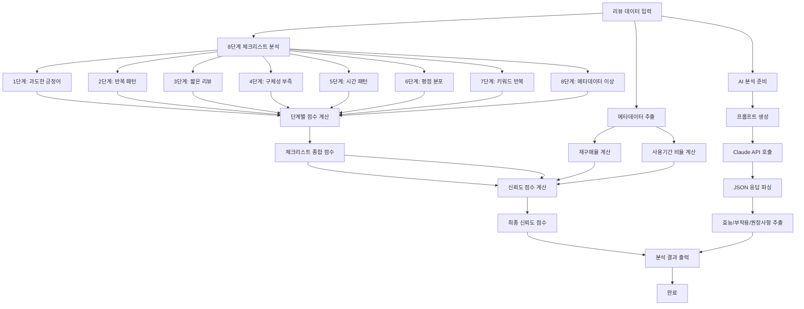
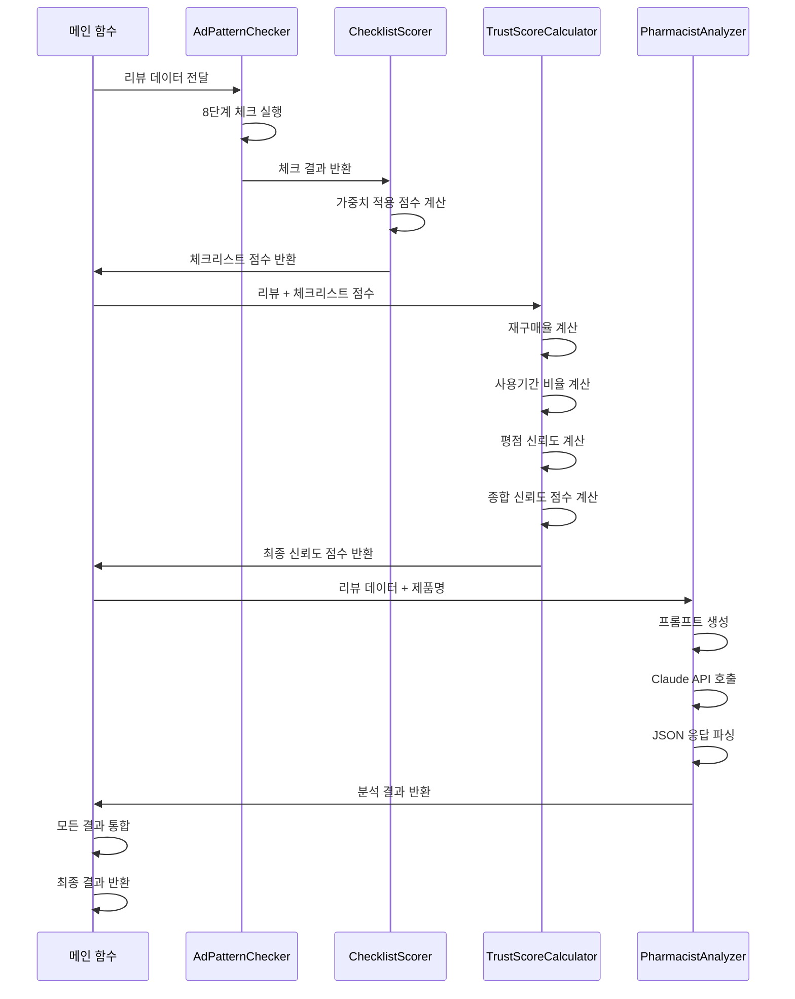

# 팀원 B: 로직 설계 및 AI 분석 담당 가이드

## 📋 역할 개요

**목표:** "리뷰의 진위여부를 가리고, 약사의 시각으로 요약한다."

기획서의 8단계 광고 판별 체크리스트를 코드로 구현하고, 신뢰도 점수를 계산한 후, **Claude API**를 사용하여 약사 페르소나로 리뷰를 분석하는 역할을 담당합니다.

---

## 🎯 상세 미션

### 1. 8단계 광고 판별 체크리스트 구현
- 각 단계별 패턴 감지 로직 구현
- 단계별 점수 계산
- 종합 점수 산출

### 2. 신뢰도 점수 계산
- 체크리스트 점수 반영
- 재구매율, 사용기간 등 메타데이터 반영
- 최종 신뢰도 점수 계산

### 3. Claude API 약사 페르소나 분석
- 약사 페르소나 프롬프트 구성
- Claude API 호출
- JSON 형식 응답 파싱
- 효능, 부작용, 권장사항 추출

---

## 🏗️ 시스템 아키텍처



---

## 📁 파일 구조

```
logic_designer/
├── __init__.py              # 패키지 초기화
├── checklist.py             # 8단계 체크리스트 구현
│   ├── AdPatternChecker     # 광고 패턴 체크 클래스
│   └── ChecklistScorer      # 체크리스트 점수 계산
├── trust_score.py           # 신뢰도 점수 계산
│   ├── TrustScoreCalculator # 신뢰도 계산기
│   └── TrustLevelClassifier # 신뢰도 등급 분류
├── ai_analyzer.py           # Claude API 분석 모듈
│   ├── PharmacistAnalyzer   # 약사 페르소나 분석기
│   ├── PromptBuilder        # 프롬프트 빌더
│   └── ResponseParser       # 응답 파서
├── config.py                # 설정 파일
│   ├── CHECKLIST_WEIGHTS    # 체크리스트 가중치
│   ├── TRUST_FORMULA        # 신뢰도 공식
│   └── PROMPT_TEMPLATES     # 프롬프트 템플릿
└── utils.py                 # 공통 유틸리티
    ├── text_analyzer        # 텍스트 분석 유틸
    └── statistics           # 통계 계산 유틸
```

---

## 🔧 기술 스택

- **AI/ML:**
  - `anthropic`: Claude API 호출

- **텍스트 분석:**
  - `re`: 정규표현식 (내장)
  - `collections`: 텍스트 통계 (내장)

- **데이터 처리:**
  - `pandas` (2.0.0+): 데이터 조작
  - `numpy` (1.24.0+): 수치 계산 (선택)

- **기타:**
  - `json`: JSON 처리 (내장)
  - `python-dotenv`: 환경 변수 관리

---

## 📝 주요 클래스 및 함수 설계

### 1. `checklist.py`

#### `AdPatternChecker`
```python
class AdPatternChecker:
    """8단계 광고 패턴 체크 클래스"""
    
    def __init__(self):
        """체크리스트 패턴 초기화"""
    
    def check_all_patterns(self, review: Dict) -> Dict:
        """
        8단계 체크리스트 전체 실행
        
        Args:
            review: 리뷰 딕셔너리
        
        Returns:
            Dict: 각 단계별 체크 결과
            {
                'step1': {'detected': bool, 'score': float, 'details': str},
                'step2': {...},
                ...
                'step8': {...}
            }
        """
    
    def check_step1_excessive_positive(self, review: Dict) -> Dict:
        """
        1단계: 과도한 긍정어 체크
        
        패턴:
        - "최고", "완벽", "대박" 등 과도한 긍정어 반복
        - 감탄사 과다 사용
        """
    
    def check_step2_repetitive_pattern(self, review: Dict) -> Dict:
        """
        2단계: 반복 패턴 체크
        
        패턴:
        - 동일한 문구 반복
        - 템플릿화된 표현
        """
    
    def check_step3_short_review(self, review: Dict) -> Dict:
        """
        3단계: 짧은 리뷰 체크
        
        패턴:
        - 너무 짧은 리뷰 (10자 미만)
        - 의미 없는 내용
        """
    
    def check_step4_lack_specificity(self, review: Dict) -> Dict:
        """
        4단계: 구체성 부족 체크
        
        패턴:
        - 추상적인 표현만 사용
        - 구체적인 경험 부재
        """
    
    def check_step5_time_pattern(self, reviews: List[Dict]) -> Dict:
        """
        5단계: 시간 패턴 체크
        
        패턴:
        - 짧은 시간 내 다수 리뷰 작성
        - 비정상적인 시간대 집중
        """
    
    def check_step6_rating_distribution(self, reviews: List[Dict]) -> Dict:
        """
        6단계: 평점 분포 체크
        
        패턴:
        - 극단적인 평점 분포 (5점만 또는 1점만)
        - 비정상적인 평점 패턴
        """
    
    def check_step7_keyword_repetition(self, reviews: List[Dict]) -> Dict:
        """
        7단계: 키워드 반복 체크
        
        패턴:
        - 동일 키워드 과다 사용
        - 마케팅 용어 반복
        """
    
    def check_step8_metadata_anomaly(self, reviews: List[Dict]) -> Dict:
        """
        8단계: 메타데이터 이상 체크
        
        패턴:
        - 재구매율 비정상
        - 사용기간 패턴 이상
        - 인증 리뷰 비율 이상
        """
```

#### `ChecklistScorer`
```python
class ChecklistScorer:
    """체크리스트 점수 계산 클래스"""
    
    def __init__(self, weights: Dict = None):
        """
        Args:
            weights: 각 단계별 가중치
            {
                'step1': 0.15,
                'step2': 0.15,
                ...
            }
        """
    
    def calculate_score(self, check_results: Dict) -> float:
        """
        체크리스트 종합 점수 계산
        
        Args:
            check_results: AdPatternChecker.check_all_patterns() 결과
        
        Returns:
            float: 0.0 ~ 1.0 (1.0이 가장 신뢰도 높음)
        """
    
    def get_detailed_breakdown(self, check_results: Dict) -> Dict:
        """단계별 상세 점수 반환"""
```

### 2. `trust_score.py`

#### `TrustScoreCalculator`
```python
class TrustScoreCalculator:
    """신뢰도 점수 계산 클래스"""
    
    def __init__(self, formula_config: Dict = None):
        """
        Args:
            formula_config: 신뢰도 공식 설정
            {
                'checklist_weight': 0.4,
                'reorder_weight': 0.3,
                'usage_period_weight': 0.2,
                'rating_weight': 0.1
            }
        """
    
    def calculate(self, reviews: List[Dict], checklist_score: float) -> float:
        """
        최종 신뢰도 점수 계산
        
        Args:
            reviews: 리뷰 리스트
            checklist_score: 체크리스트 점수 (0.0 ~ 1.0)
        
        Returns:
            float: 0 ~ 100 점
        """
    
    def calculate_reorder_rate(self, reviews: List[Dict]) -> float:
        """재구매율 계산"""
    
    def calculate_usage_period_rate(self, reviews: List[Dict]) -> float:
        """한달 이상 사용자 비율 계산"""
    
    def calculate_rating_credibility(self, reviews: List[Dict]) -> float:
        """평점 신뢰도 계산"""
```

#### `TrustLevelClassifier`
```python
class TrustLevelClassifier:
    """신뢰도 등급 분류 클래스"""
    
    def classify(self, score: float) -> str:
        """
        신뢰도 등급 분류
        
        Args:
            score: 신뢰도 점수 (0 ~ 100)
        
        Returns:
            str: 'high' | 'medium' | 'low'
        """
    
    def get_thresholds(self) -> Dict:
        """등급별 임계값 반환"""
```

### 3. `ai_analyzer.py`

#### `PromptBuilder`
```python
class PromptBuilder:
    """약사 페르소나 프롬프트 빌더"""
    
    def build_pharmacist_prompt(self, reviews: List[Dict], product_name: str) -> str:
        """
        약사 페르소나 프롬프트 생성
        
        Returns:
            str: 완성된 프롬프트
        """
    
    def _get_pharmacist_persona(self) -> str:
        """약사 페르소나 설명"""
    
    def _format_reviews(self, reviews: List[Dict]) -> str:
        """리뷰 데이터 포맷팅"""
```

#### `PharmacistAnalyzer`
```python
class PharmacistAnalyzer:
    """Claude API 약사 페르소나 분석기"""

    def __init__(self, api_key: str = None):
        """
        Args:
            api_key: Anthropic API 키 (없으면 환경변수에서 로드)
        """
    
    def analyze(self, reviews: List[Dict], product_name: str) -> Dict:
        """
        약사 페르소나로 리뷰 분석
        
        Args:
            reviews: 리뷰 리스트
            product_name: 제품명
        
        Returns:
            Dict: 분석 결과
            {
                'summary': '종합 요약',
                'efficacy': ['효능1', '효능2', ...],
                'side_effects': ['부작용1', '부작용2', ...],
                'recommendations': '권장사항',
                'trust_assessment': '신뢰도 평가',
                'warnings': ['주의사항1', ...]
            }
        """
    
    def _call_claude(self, prompt: str) -> str:
        """Claude API 호출"""

    def _parse_response(self, response: str) -> Dict:
        """JSON 응답 파싱"""
```

#### `ResponseParser`
```python
class ResponseParser:
    """Claude 응답 파서"""

    def parse(self, response_text: str) -> Dict:
        """
        JSON 응답 파싱

        Args:
            response_text: Claude 응답 텍스트

        Returns:
            Dict: 파싱된 분석 결과
        """
    
    def _extract_json(self, text: str) -> Dict:
        """텍스트에서 JSON 추출"""
    
    def _validate_structure(self, data: Dict) -> bool:
        """응답 구조 검증"""
```

---

## 🔄 데이터 흐름



---

## 📊 데이터 구조

### 입력 데이터
```python
reviews = [
    {
        'text': '리뷰 텍스트',
        'rating': 5,
        'date': '2024-01-15',
        'reorder': True,
        'one_month_use': True,
        'reviewer': '사용자명',
        'verified': True
    },
    ...
]
```

### 체크리스트 결과
```python
check_results = {
    'step1': {
        'detected': True,
        'score': 0.3,  # 0.0 ~ 1.0 (낮을수록 의심)
        'details': '과도한 긍정어 5회 사용'
    },
    'step2': {...},
    ...
    'total_score': 0.65  # 종합 점수
}
```

### 신뢰도 점수 결과
```python
trust_result = {
    'score': 75.5,  # 0 ~ 100
    'level': 'high',  # 'high' | 'medium' | 'low'
    'breakdown': {
        'checklist': 0.65,
        'reorder_rate': 0.45,
        'usage_period': 0.68,
        'rating_credibility': 0.82
    }
}
```

### AI 분석 결과
```python
ai_result = {
    'summary': '종합 분석 요약...',
    'efficacy': [
        '콜레스테롤 수치 개선',
        '관절 통증 완화',
        '피로감 감소'
    ],
    'side_effects': [
        '속쓰림 (소수)'
    ],
    'recommendations': '식후 복용 권장...',
    'trust_assessment': '리뷰의 진실성 측면에서 우수...',
    'warnings': ['위장이 약한 분들은 주의']
}
```

---

## 🛠️ 구현 가이드

### 1단계: 체크리스트 기본 구조

```python
# logic_designer/checklist.py
from typing import Dict, List
import re
from collections import Counter

class AdPatternChecker:
    # 과도한 긍정어 패턴
    EXCESSIVE_POSITIVE_WORDS = [
        '최고', '완벽', '대박', '최고급', '최상급',
        '완전', '진짜', '정말최고', '최고최고'
    ]
    
    def check_step1_excessive_positive(self, review: Dict) -> Dict:
        """1단계: 과도한 긍정어 체크"""
        text = review.get('text', '').lower()
        count = sum(1 for word in self.EXCESSIVE_POSITIVE_WORDS 
                   if word in text)
        
        detected = count >= 3
        score = max(0.0, 1.0 - (count * 0.2))
        
        return {
            'detected': detected,
            'score': score,
            'details': f'과도한 긍정어 {count}회 사용'
        }
    
    def check_step2_repetitive_pattern(self, review: Dict) -> Dict:
        """2단계: 반복 패턴 체크"""
        text = review.get('text', '')
        
        # 동일 문구 3회 이상 반복 체크
        words = text.split()
        word_counts = Counter(words)
        max_repeat = max(word_counts.values()) if word_counts else 0
        
        detected = max_repeat >= 3
        score = max(0.0, 1.0 - (max_repeat * 0.15))
        
        return {
            'detected': detected,
            'score': score,
            'details': f'최대 반복 횟수: {max_repeat}'
        }
    
    def check_step3_short_review(self, review: Dict) -> Dict:
        """3단계: 짧은 리뷰 체크"""
        text = review.get('text', '')
        length = len(text.strip())
        
        detected = length < 10
        score = 1.0 if length >= 20 else (length / 20.0)
        
        return {
            'detected': detected,
            'score': score,
            'details': f'리뷰 길이: {length}자'
        }
    
    # ... 나머지 단계들 구현
```

### 2단계: 신뢰도 점수 계산

```python
# logic_designer/trust_score.py
from typing import Dict, List

class TrustScoreCalculator:
    def __init__(self):
        self.config = {
            'checklist_weight': 0.4,
            'reorder_weight': 0.3,
            'usage_period_weight': 0.2,
            'rating_weight': 0.1
        }
    
    def calculate(self, reviews: List[Dict], checklist_score: float) -> float:
        """최종 신뢰도 점수 계산"""
        reorder_rate = self.calculate_reorder_rate(reviews)
        usage_rate = self.calculate_usage_period_rate(reviews)
        rating_cred = self.calculate_rating_credibility(reviews)
        
        # 가중 평균 계산
        score = (
            checklist_score * self.config['checklist_weight'] +
            reorder_rate * self.config['reorder_weight'] +
            usage_rate * self.config['usage_period_weight'] +
            rating_cred * self.config['rating_weight']
        )
        
        return score * 100  # 0 ~ 100 점으로 변환
    
    def calculate_reorder_rate(self, reviews: List[Dict]) -> float:
        """재구매율 계산"""
        if not reviews:
            return 0.0
        
        reorder_count = sum(1 for r in reviews if r.get('reorder', False))
        return reorder_count / len(reviews)
    
    def calculate_usage_period_rate(self, reviews: List[Dict]) -> float:
        """한달 이상 사용자 비율 계산"""
        if not reviews:
            return 0.0
        
        usage_count = sum(1 for r in reviews 
                         if r.get('one_month_use', False))
        return usage_count / len(reviews)
```

### 3단계: Claude API 분석 구현

```python
# logic_designer/ai_analyzer.py
import anthropic
import json
import os
import re
from typing import Dict, List

class PharmacistAnalyzer:
    def __init__(self, api_key: str = None):
        self.api_key = api_key or os.getenv('ANTHROPIC_API_KEY')
        self.client = anthropic.Anthropic(api_key=self.api_key)

    def analyze(self, reviews: List[Dict], product_name: str) -> Dict:
        """약사 페르소나로 리뷰 분석"""
        prompt = self._build_prompt(reviews, product_name)
        response = self._call_claude(prompt)
        return self._parse_response(response)

    def _build_prompt(self, reviews: List[Dict], product_name: str) -> str:
        """프롬프트 생성"""
        reviews_text = self._format_reviews(reviews)

        prompt = f"""당신은 20년 경력의 전문 약사입니다.
다음 제품의 리뷰를 분석하여 의학적 관점에서 평가해주세요.

제품명: {product_name}

리뷰 데이터:
{reviews_text}

다음 JSON 형식으로 응답해주세요:
{{
    "summary": "종합 분석 요약 (200자 이내)",
    "efficacy": ["효능1", "효능2", ...],
    "side_effects": ["부작용1", "부작용2", ...],
    "recommendations": "권장사항 및 주의사항",
    "trust_assessment": "리뷰 신뢰도 평가",
    "warnings": ["주의사항1", "주의사항2", ...]
}}

약사로서 다음을 고려해주세요:
1. 리뷰의 진실성과 신뢰도
2. 보고된 효능의 의학적 타당성
3. 부작용의 심각도와 빈도
4. 특정 환자군에 대한 주의사항
"""
        return prompt

    def _call_claude(self, prompt: str) -> str:
        """Claude API 호출"""
        message = self.client.messages.create(
            model="claude-sonnet-4-20250514",
            max_tokens=2000,
            system="당신은 전문 약사입니다.",
            messages=[
                {"role": "user", "content": prompt}
            ]
        )
        return message.content[0].text

    def _parse_response(self, response: str) -> Dict:
        """JSON 응답 파싱"""
        try:
            # JSON 추출
            json_match = re.search(r'\{.*\}', response, re.DOTALL)
            if json_match:
                return json.loads(json_match.group())
            else:
                return {'error': 'JSON 파싱 실패'}
        except json.JSONDecodeError:
            return {'error': 'JSON 형식 오류'}
```

---

## ⚙️ 설정 파일 예시

```python
# logic_designer/config.py

# 체크리스트 가중치
CHECKLIST_WEIGHTS = {
    'step1': 0.15,  # 과도한 긍정어
    'step2': 0.15,  # 반복 패턴
    'step3': 0.10,  # 짧은 리뷰
    'step4': 0.15,  # 구체성 부족
    'step5': 0.10,  # 시간 패턴
    'step6': 0.15,  # 평점 분포
    'step7': 0.10,  # 키워드 반복
    'step8': 0.10   # 메타데이터 이상
}

# 신뢰도 공식 가중치
TRUST_FORMULA = {
    'checklist_weight': 0.4,
    'reorder_weight': 0.3,
    'usage_period_weight': 0.2,
    'rating_weight': 0.1
}

# 신뢰도 등급 임계값
TRUST_THRESHOLDS = {
    'high': 70,
    'medium': 50,
    'low': 0
}

# 프롬프트 템플릿
PHARMACIST_PROMPT_TEMPLATE = """
당신은 20년 경력의 전문 약사입니다.
...
"""
```

---

## ⚠️ 주의사항 및 베스트 프랙티스

### 1. 체크리스트 구현
- **기획서 반영 필수:** 실제 8단계 체크리스트 내용을 기획서에서 확인하여 정확히 구현
- **가중치 조정:** 각 단계의 중요도에 따라 가중치 설정
- **임계값 튜닝:** 실제 데이터로 테스트하여 임계값 조정

### 2. Claude API 사용
- **API 키 보안:** 환경 변수로 관리 (ANTHROPIC_API_KEY), 코드에 하드코딩 금지
- **비용 관리:** 토큰 사용량 모니터링
- **에러 핸들링:** API 호출 실패 시 재시도 로직
- **응답 검증:** JSON 파싱 실패 대비

### 3. 성능 최적화
- **배치 처리:** 여러 리뷰를 한 번에 분석
- **캐싱:** 동일 리뷰 재분석 방지
- **비동기 처리:** API 호출 최적화 (선택)

---

## 🧪 테스트 예시

```python
# tests/test_checklist.py
from logic_designer.checklist import AdPatternChecker

def test_excessive_positive():
    checker = AdPatternChecker()
    review = {'text': '최고 최고 완벽 대박 정말최고!'}
    result = checker.check_step1_excessive_positive(review)
    
    assert result['detected'] == True
    assert result['score'] < 0.5

# tests/test_trust_score.py
from logic_designer.trust_score import TrustScoreCalculator

def test_trust_calculation():
    calculator = TrustScoreCalculator()
    reviews = [
        {'reorder': True, 'one_month_use': True},
        {'reorder': False, 'one_month_use': True},
    ]
    checklist_score = 0.8
    
    score = calculator.calculate(reviews, checklist_score)
    assert 0 <= score <= 100
```

---

## 📚 참고 자료

- [Anthropic Claude API 문서](https://docs.anthropic.com/claude/reference)
- [Claude Messages API 가이드](https://docs.anthropic.com/claude/docs/messages-api)
- [Python anthropic SDK](https://github.com/anthropics/anthropic-sdk-python)
- 정규표현식: [Python re 모듈](https://docs.python.org/3/library/re.html)

---

## ✅ 체크리스트

- [ ] AdPatternChecker 클래스 구현
- [ ] 8단계 체크리스트 모두 구현 (기획서 반영)
- [ ] ChecklistScorer 구현
- [ ] TrustScoreCalculator 구현
- [ ] 신뢰도 공식 구현 (기획서 반영)
- [ ] PharmacistAnalyzer 구현
- [ ] Claude API 연동
- [ ] 프롬프트 템플릿 작성
- [ ] JSON 응답 파싱 구현
- [ ] 에러 핸들링 추가
- [ ] 단위 테스트 작성

---

## 📌 기획서 반영 필요 사항

**중요:** 다음 항목은 기획서 내용을 확인하여 정확히 구현해야 합니다:

1. **8단계 체크리스트 상세 내용**
   - 각 단계의 정확한 판별 기준
   - 패턴 정의
   - 점수 계산 방식

2. **신뢰도 점수 공식**
   - 정확한 공식
   - 가중치 값
   - 등급 분류 기준

3. **약사 페르소나 프롬프트**
   - 구체적인 지시사항
   - 응답 형식 요구사항
