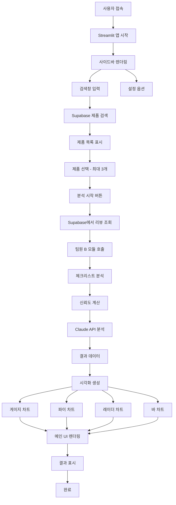
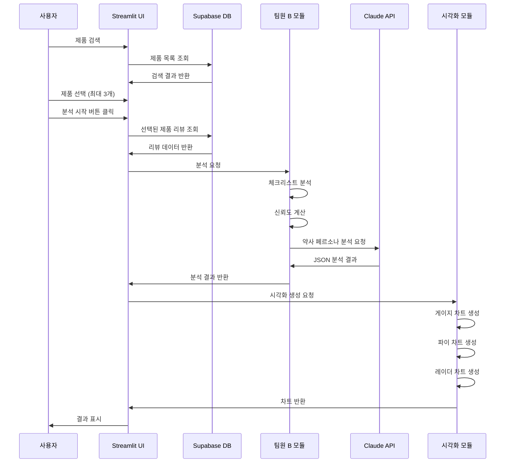

# 팀원 C: 화면 구현 및 통합 담당 가이드

## 📋 역할 개요

**목표:** "결과물을 멋진 웹 대시보드로 보여준다."

Supabase에 저장된 루테인 제품 데이터를 조회하고, 팀원 B(로직 설계 및 AI 분석)가 만든 분석 기능을 연결하여 하나의 Streamlit 웹 서비스로 통합하고, 게이지 차트, 파이 차트 등을 활용해 신뢰도를 시각화하는 역할을 담당합니다.

---

## 🎯 상세 미션

### 1. Supabase 연동 및 팀원 B 기능 통합
- Supabase에서 제품/리뷰 데이터 조회
- 로직 분석 모듈 연결
- 전체 워크플로우 구현

### 2. Streamlit 웹 서비스 구현
- 사이드바: **검색창**, 제품 선택, 설정 옵션
- 메인 화면: 분석 결과 표시
- 3종 비교 기능

### 3. 시각화 구현
- 게이지 차트 (신뢰도 점수)
- 파이 차트 (광고 의심 비율 등)
- 레이더 차트 (3종 비교)
- 바 차트 (재구매율, 사용기간 등)

---

## 🏗️ 시스템 아키텍처



---

## 📁 파일 구조

```
ui_integration/
├── app.py              # Streamlit 메인 앱 (390줄)
│   ├── main()         # 메인 함수
│   ├── CSS 스타일     # 커스텀 CSS 정의
│   └── 섹션별 렌더링  # 제품카드, 비교표, 차트, 리뷰 표시
├── mock_data.py        # 목업 데이터 생성 (323줄)
│   ├── PRODUCTS        # 루테인 제품 5종
│   ├── generate_reviews_for_product()  # 리뷰 생성
│   ├── generate_checklist_results()    # 체크리스트
│   ├── generate_ai_analysis()          # AI 분석 결과
│   └── 데이터 접근 함수 # get_all_products, search_products 등
├── visualizations.py   # 시각화 컴포넌트 (355줄)
│   ├── render_gauge_chart()            # 신뢰도 게이지
│   ├── render_trust_badge()            # 신뢰도 배지
│   ├── render_comparison_table()       # 비교 테이블
│   ├── render_radar_chart()            # 레이더 차트
│   ├── render_review_sentiment_chart() # 평점 분포 차트
│   ├── render_checklist_visual()       # 체크리스트 시각화
│   └── render_price_comparison_chart() # 가격 비교 차트
├── requirements.txt    # 의존성: streamlit, plotly, pandas
└── README.md          # 설치/실행 가이드
```

---

## 🔧 기술 스택

- **웹 프레임워크:**
  - `streamlit` (1.31.0+): 웹 앱 프레임워크

- **시각화:**
  - `plotly` (5.18.0+): 인터랙티브 차트

- **데이터 처리:**
  - `pandas` (2.1.0+): 데이터 조작 및 테이블 렌더링

---

## 📝 주요 함수 설계

### 1. `mock_data.py` (목업 데이터 관리)

```python
# ui_integration/mock_data.py

# 루테인 제품 5종 정의
PRODUCTS = [
    {
        "id": "p001",
        "name": "Lutein 20mg",
        "brand": "NOW Foods",
        "price": 14.99,
        "serving_size": "1 Softgel",
        ...
    },
    # ... 4종 추가
]

def generate_reviews_for_product(product_id, product_name, count=20):
    """
    각 제품당 20개의 다양한 리뷰 생성
    - 긍정 (60%), 중립 (20%), 부정 (15%), 광고성 (5%)
    """
    reviews = []
    for i in range(count):
        # 리뷰 타입 결정 및 생성
        review = {
            "product_id": product_id,
            "text": review_text,
            "rating": rating,
            "date": date,
            "reorder": reorder,
            "one_month_use": one_month_use,
            "reviewer": reviewer,
            "verified": verified
        }
        reviews.append(review)
    return reviews

def generate_checklist_results(reviews):
    """8단계 체크리스트 결과 생성"""
    return {
        "1_verified_purchase": {"passed": ..., "rate": ..., "description": ...},
        "2_reorder_rate": {...},
        "3_long_term_use": {...},
        "4_rating_distribution": {...},
        "5_review_length": {...},
        "6_time_distribution": {...},
        "7_ad_detection": {...},
        "8_reviewer_diversity": {...}
    }

def generate_ai_analysis(product, checklist):
    """AI 약사의 분석 결과 생성"""
    return {
        "trust_score": float,
        "trust_level": "high|medium|low",
        "summary": str,
        "efficacy": str,
        "side_effects": str,
        "recommendations": str,
        "warnings": str
    }

# 데이터 접근 함수
def get_all_products() -> List[Dict]
def get_product_by_id(product_id) -> Dict
def get_reviews_by_product(product_id) -> List[Dict]
def get_analysis_result(product_id) -> Dict
def get_all_analysis_results() -> Dict
def search_products(query) -> List[Dict]
```

### 2. `app.py` (메인 UI 앱)

```python
# ui_integration/app.py

st.set_page_config(
    page_title="건기식 리뷰 팩트체크",
    page_icon="🔍",
    layout="wide",
    initial_sidebar_state="expanded"
)

def main():
    """메인 앱 함수"""
    # 헤더
    st.markdown('<div class="main-title">🔍 건기식 리뷰 팩트체크</div>', unsafe_allow_html=True)
    st.markdown('<div class="sub-title">루테인 제품 상위 3종 비교 분석</div>', unsafe_allow_html=True)

    # 사이드바 - 검색 및 필터
    with st.sidebar:
        st.markdown("### 🔎 제품 검색")
        search_query = st.text_input(
            "제품명 또는 브랜드 검색",
            placeholder="예: NOW Foods, Lutein...",
            key="search"
        )
        st.markdown("### ℹ️ 신뢰도 등급 안내")
        st.markdown("""
        - **HIGH (70점 이상)**: 신뢰할 수 있는 제품
        - **MEDIUM (50-70점)**: 보통 수준
        - **LOW (50점 미만)**: 주의 필요
        """)

    # 데이터 로드
    all_analysis = get_all_analysis_results()

    # 검색 처리
    if search_query:
        filtered_products = search_products(search_query)
        products_data = [all_analysis[p["id"]] for p in filtered_products]
    else:
        products_data = list(all_analysis.values())

    # 신뢰도 점수 기준 정렬 (내림차순)
    products_data_sorted = sorted(
        products_data,
        key=lambda x: x["ai_result"]["trust_score"],
        reverse=True
    )

    # 상위 3개 선별
    top3_products = products_data_sorted[:3]
    other_products = products_data_sorted[3:]

    # 섹션 1: 상위 3개 제품 카드 (가로 배치)
    st.markdown('<div class="section-header">📦 제품 개요 (상위 3개)</div>', unsafe_allow_html=True)

    cols = st.columns(3)
    rank_badges = {0: "🥇", 1: "🥈", 2: "🥉"}

    for idx, data in enumerate(top3_products):
        product = data["product"]
        ai_result = data["ai_result"]

        with cols[idx]:
            st.markdown(f'<div style="text-align: center; font-size: 36px;">{rank_badges[idx]}</div>', unsafe_allow_html=True)
            st.markdown(f"**{product['brand']}**")
            st.markdown(f"<small>{product['name']}</small>", unsafe_allow_html=True)

            # 신뢰도 게이지
            fig_gauge = render_gauge_chart(ai_result["trust_score"], "신뢰도")
            st.plotly_chart(fig_gauge, key=f"gauge_{product['id']}")

            # 신뢰도 배지
            st.markdown(render_trust_badge(ai_result["trust_level"]), unsafe_allow_html=True)

    # 섹션 2: 비교 테이블 (상위 3개만)
    st.markdown('<div class="section-header">📊 종합 비교표 (상위 3개)</div>', unsafe_allow_html=True)

    comparison_df = render_comparison_table(top3_products)
    st.dataframe(comparison_df, hide_index=True, height=250)

    # 섹션 3: 차트 분석 (상위 3개만)
    st.markdown('<div class="section-header">📈 시각화 분석 (상위 3개)</div>', unsafe_allow_html=True)

    col1, col2 = st.columns(2)

    with col1:
        st.markdown("#### 🕸️ 다차원 비교 (레이더 차트)")
        fig_radar = render_radar_chart(top3_products)
        st.plotly_chart(fig_radar, key="radar_main")

    with col2:
        st.markdown("#### 💰 가격 비교")
        fig_price = render_price_comparison_chart(top3_products)
        st.plotly_chart(fig_price, key="price_main")
```

### 3. `visualizations.py` (시각화 컴포넌트)

```python
# ui_integration/visualizations.py

def render_gauge_chart(score, title="신뢰도"):
    """
    신뢰도 게이지 차트 렌더링

    Args:
        score (float): 0-100 사이의 점수
        title (str): 차트 제목

    Returns:
        plotly.graph_objects.Figure
    """
    if score >= 70:
        color = "#22c55e"  # green
        level = "HIGH"
    elif score >= 50:
        color = "#f59e0b"  # amber
        level = "MEDIUM"
    else:
        color = "#ef4444"  # red
        level = "LOW"

    fig = go.Figure(go.Indicator(
        mode="gauge+number+delta",
        value=score,
        number={'suffix': "", 'font': {'size': 32, 'color': color}},
        gauge={
            'axis': {'range': [0, 100], 'tickwidth': 1},
            'bar': {'color': color, 'thickness': 0.75},
            'steps': [
                {'range': [0, 50], 'color': '#fee2e2'},
                {'range': [50, 70], 'color': '#fef3c7'},
                {'range': [70, 100], 'color': '#dcfce7'}
            ],
            'threshold': {
                'line': {'color': "darkgray", 'width': 4},
                'thickness': 0.75,
                'value': score
            }
        }
    ))

    fig.update_layout(height=200, margin=dict(l=20, r=20, t=40, b=20))
    return fig


def render_trust_badge(level):
    """
    신뢰도 등급 배지 렌더링 (HTML)

    Args:
        level (str): 'high', 'medium', 'low'

    Returns:
        str: HTML 배지 코드
    """
    badge_configs = {
        "high": {"text": "HIGH TRUST", "bg_color": "#22c55e", "icon": "✓"},
        "medium": {"text": "MEDIUM TRUST", "bg_color": "#f59e0b", "icon": "○"},
        "low": {"text": "LOW TRUST", "bg_color": "#ef4444", "icon": "✕"}
    }

    config = badge_configs.get(level.lower(), badge_configs["medium"])

    return f"""
    <div style="display: inline-block; background-color: {config['bg_color']};
        color: white; padding: 4px 12px; border-radius: 12px;
        font-weight: bold; font-size: 12px;">
        {config['icon']} {config['text']}
    </div>
    """


def render_comparison_table(products_data):
    """
    제품 비교 테이블 렌더링 (pandas DataFrame)

    Args:
        products_data (list): 제품 분석 결과 리스트

    Returns:
        pandas.DataFrame
    """
    table_data = []

    for data in products_data:
        product = data["product"]
        ai_result = data["ai_result"]
        reviews = data["reviews"]

        ad_suspected = sum(1 for r in reviews if r["rating"] == 5 and not r["one_month_use"] and len(r["text"]) < 100)
        ad_rate = ad_suspected / len(reviews) * 100 if reviews else 0

        reorder_rate = sum(1 for r in reviews if r["reorder"]) / len(reviews) * 100 if reviews else 0
        one_month_rate = sum(1 for r in reviews if r["one_month_use"]) / len(reviews) * 100 if reviews else 0
        avg_rating = sum(r["rating"] for r in reviews) / len(reviews) if reviews else 0

        table_data.append({
            "제품명": f"{product['brand']}\n{product['name']}",
            "신뢰도": f"{ai_result['trust_score']:.1f}",
            "광고의심률": f"{ad_rate:.1f}%",
            "재구매율": f"{reorder_rate:.1f}%",
            "한달사용": f"{one_month_rate:.1f}%",
            "평균평점": f"{avg_rating:.1f}"
        })

    return pd.DataFrame(table_data)


def render_radar_chart(products_data):
    """
    5개 제품 다차원 비교 레이더 차트

    Args:
        products_data (list): 제품 분석 결과 리스트

    Returns:
        plotly.graph_objects.Figure
    """
    fig = go.Figure()

    categories = ['신뢰도', '재구매율', '한달사용', '평균평점', '리뷰다양성']
    colors = ['#3b82f6', '#22c55e', '#f59e0b', '#ef4444', '#8b5cf6']

    for idx, data in enumerate(products_data):
        product = data["product"]
        ai_result = data["ai_result"]
        reviews = data["reviews"]

        trust_score = ai_result['trust_score']
        reorder_rate = sum(1 for r in reviews if r["reorder"]) / len(reviews) * 100 if reviews else 0
        one_month_rate = sum(1 for r in reviews if r["one_month_use"]) / len(reviews) * 100 if reviews else 0
        avg_rating = sum(r["rating"] for r in reviews) / len(reviews) * 20 if reviews else 0
        diversity_rate = len(set(r["reviewer"] for r in reviews)) / len(reviews) * 100 if reviews else 0

        values = [trust_score, reorder_rate, one_month_rate, avg_rating, diversity_rate]

        fig.add_trace(go.Scatterpolar(
            r=values,
            theta=categories,
            fill='toself',
            name=f"{product['brand']}",
            line=dict(color=colors[idx % len(colors)], width=2),
            opacity=0.6
        ))

    fig.update_layout(
        polar=dict(radialaxis=dict(visible=True, range=[0, 100])),
        showlegend=True,
        height=400,
        margin=dict(l=80, r=80, t=40, b=80),
        font={'color': "#1f2937", 'family': "Arial"}
    )

    return fig


def render_review_sentiment_chart(reviews):
    """
    리뷰 감정 분포 차트 (평점별)

    Args:
        reviews (list): 리뷰 리스트

    Returns:
        plotly.graph_objects.Figure
    """
    rating_counts = {1: 0, 2: 0, 3: 0, 4: 0, 5: 0}

    for review in reviews:
        rating_counts[review["rating"]] += 1

    fig = go.Figure(data=[
        go.Bar(
            x=list(rating_counts.keys()),
            y=list(rating_counts.values()),
            marker_color=['#ef4444', '#f97316', '#f59e0b', '#22c55e', '#10b981'],
            text=list(rating_counts.values()),
            textposition='auto',
        )
    ])

    fig.update_layout(
        title="평점 분포",
        xaxis_title="평점 (별점)",
        yaxis_title="리뷰 수",
        height=300,
        showlegend=False
    )

    return fig


def render_checklist_visual(checklist_results):
    """
    8단계 체크리스트 시각화 (Streamlit 컴포넌트 사용)

    Args:
        checklist_results (dict): 체크리스트 결과

    Note:
        이 함수는 Streamlit 컴포넌트를 직접 렌더링합니다.
    """
    for key, result in checklist_results.items():
        step_name = result["description"]
        rate = result["rate"]
        passed = result["passed"]

        icon = "✅" if passed else "❌"
        color = "green" if passed else "red"

        st.markdown(f"{icon} **{step_name}** - :{color}[{rate * 100:.0f}%]")
        st.progress(rate)


def render_price_comparison_chart(products_data):
    """
    가격 비교 차트

    Args:
        products_data (list): 제품 분석 결과 리스트

    Returns:
        plotly.graph_objects.Figure
    """
    product_names = []
    prices = []
    trust_scores = []

    for data in products_data:
        product = data["product"]
        ai_result = data["ai_result"]

        product_names.append(f"{product['brand']}")
        prices.append(product["price"])
        trust_scores.append(ai_result["trust_score"])

    colors = ['#22c55e' if score >= 70 else '#f59e0b' if score >= 50 else '#ef4444' for score in trust_scores]

    fig = go.Figure(data=[
        go.Bar(
            x=product_names,
            y=prices,
            marker_color=colors,
            text=[f"${p:.2f}" for p in prices],
            textposition='auto',
        )
    ])

    fig.update_layout(
        title="제품 가격 비교",
        xaxis_title="브랜드",
        yaxis_title="가격 (USD)",
        height=300,
        showlegend=False
    )

    return fig
```

---

## 🔄 전체 워크플로우



---

## 🎨 UI 레이아웃 설계

### 메인 레이아웃 구조

```
┌─────────────────────────────────────────────────┐
│  사이드바 (고정)  │  메인 콘텐츠 영역            │
│                  │                              │
│  🔍 분석 설정     │  📊 분석 결과                 │
│                  │                              │
│  제품 검색       │  ┌────────────────────────┐  │
│  [검색창    🔍]  │  │  제품 카드 (3개)        │  │
│                  │  │  [게이지] [게이지] [게이지]│  │
│  제품 선택       │  └────────────────────────┘  │
│  ☑ NOW Foods    │                              │
│  ☑ Doctor's Best│  ┌────────────────────────┐  │
│  ☐ Jarrow       │  │  비교 테이블            │  │
│                  │  └────────────────────────┘  │
│  ──────────     │                              │
│  필터 옵션       │  ┌────────────────────────┐  │
│  [체크박스]      │  │  약사 인사이트          │  │
│                  │  └────────────────────────┘  │
│  [🔬 분석 시작]  │                              │
│                  │  ┌────────────────────────┐  │
│  ✅ 2개 제품 선택│  │  레이더 차트            │  │
│                  │  └────────────────────────┘  │
└─────────────────────────────────────────────────┘
```

---

## 🛠️ 실제 구현 요약

### 개발된 주요 모듈

#### 1. `app.py` (메인 애플리케이션)
- **크기**: 390줄
- **주요 기능**:
  - 페이지 설정 및 커스텀 CSS
  - 사이드바 검색 기능
  - 상위 3개 제품 카드 표시
  - 6개 섹션으로 구성된 메인 레이아웃
  - 리뷰 상세 보기 및 필터링
  - 푸터 정보 표시

#### 2. `mock_data.py` (데이터 생성)
- **크기**: 323줄
- **포함 데이터**:
  - 루테인 제품 5종 (NOW Foods, Doctor's Best, Jarrow, Life Extension, California Gold)
  - 각 제품당 20개의 리뷰 (총 100개)
  - 다양한 리뷰 타입: 긍정(60%), 중립(20%), 부정(15%), 광고성(5%)
  - 8단계 체크리스트 결과
  - AI 약사 분석 결과

#### 3. `visualizations.py` (시각화)
- **크기**: 355줄
- **구현된 차트**:
  - 게이지 차트 (신뢰도 점수)
  - 신뢰도 배지 (HTML)
  - 비교 테이블 (pandas DataFrame)
  - 레이더 차트 (5차원 비교)
  - 평점 분포 차트 (막대 그래프)
  - 가격 비교 차트
  - 체크리스트 시각화 (progress bar)

---

## ⚠️ 주의사항 및 베스트 프랙티스

### 1. Streamlit 성능
- **캐싱 활용:** `@st.cache_data` 데코레이터로 데이터 캐싱
- **세션 상태:** 사용자 입력 상태 관리
- **비동기 처리:** 긴 작업은 백그라운드 처리 고려

### 2. 에러 핸들링
- **입력 검증:** URL 형식, 빈 값 체크
- **예외 처리:** 각 모듈 호출 시 try-except
- **사용자 피드백:** 명확한 에러 메시지

### 3. UI/UX
- **로딩 표시:** 진행 상황 표시
- **반응형 디자인:** 다양한 화면 크기 대응
- **접근성:** 색상 대비, 텍스트 크기 고려

### 4. 모듈 통합
- **의존성 관리:** 상대 경로, 절대 경로 명확히
- **데이터 형식:** 모듈 간 데이터 형식 통일
- **로깅:** 디버깅을 위한 로그 추가

---

## 🧪 테스트 예시

```python
# tests/test_ui.py
import streamlit as st
from ui_integration.components import render_trust_gauge
from ui_integration.visualizations import create_gauge_chart

def test_gauge_chart():
    fig = create_gauge_chart(85, 'high')
    assert fig is not None
    assert len(fig.data) > 0
```

---

## 📚 참고 자료

- [Streamlit 공식 문서](https://docs.streamlit.io/)
- [Plotly Python 문서](https://plotly.com/python/)
- [Streamlit 컴포넌트](https://streamlit.io/components)

---

## ✅ 체크리스트

- [x] Streamlit 기본 앱 구조 구현 (app.py - 390줄)
- [x] mock_data.py 구현 (루테인 제품 5종 + 리뷰 100개 + 분석)
- [x] 검색창 UI 구현 (사이드바 검색)
- [x] 제품 선택 및 필터 기능 구현
- [x] 메인 화면 레이아웃 구현 (6개 섹션)
- [x] 게이지 차트 구현 (render_gauge_chart)
- [x] 신뢰도 배지 구현 (render_trust_badge)
- [x] 레이더 차트 구현 (render_radar_chart)
- [x] 바 차트 구현 - 평점 분포 (render_review_sentiment_chart)
- [x] 가격 비교 차트 구현 (render_price_comparison_chart)
- [x] 비교 테이블 구현 (render_comparison_table)
- [x] 체크리스트 시각화 구현 (render_checklist_visual - st.progress)
- [x] AI 약사 인사이트 섹션 구현 (expander)
- [x] 상위 3개 제품 비교 기능 구현 (순위 배지 포함)
- [x] 리뷰 상세 보기 구현 (필터링, 하이라이트)
- [x] 광고 의심 리뷰 탐지 및 하이라이트
- [x] 커스텀 CSS 스타일 적용
- [x] 반응형 레이아웃 (가로 배치)

---

## 🚀 실행 방법

### 1. 의존성 설치

```bash
cd ui_integration
pip install -r requirements.txt
```

### 2. Streamlit 앱 실행

```bash
streamlit run app.py
```

또는 포트를 지정하여 실행:

```bash
streamlit run app.py --server.port 8501
```

### 3. 브라우저 접속

자동으로 `http://localhost:8501` 이 열립니다.

### 4. 앱 사용

1. **검색**: 사이드바에서 제품명이나 브랜드 검색
2. **필터**: 신뢰도 등급 안내 확인
3. **보기**: 상위 3개 제품 카드, 비교 테이블, 차트, 약사 인사이트, 리뷰 상세 보기 등을 순서대로 탐색

## 주요 화면 구성

### 섹션 1: 제품 개요 (상위 3개)
- 3개 카드 가로 배치
- 순위 배지 (🥇🥈🥉)
- 각 제품의 신뢰도 게이지 차트
- 신뢰도 배지

### 섹션 2: 종합 비교표 (상위 3개)
- 제품명, 신뢰도, 광고의심률, 재구매율, 한달사용, 평균평점

### 섹션 3: 시각화 분석 (상위 3개)
- 왼쪽: 레이더 차트 (5차원 비교)
- 오른쪽: 가격 비교 차트

### 섹션 4: 기타 제품
- 확장 패널에 나머지 2개 제품 표시

### 섹션 5: AI 약사 인사이트 (상위 3개)
- 각 제품별 expander
- 요약, 효능, 부작용, 권장사항, 주의사항
- 오른쪽: 체크리스트 결과 (progress bar)

### 섹션 6: 리뷰 상세 보기 (상위 3개)
- 제품 선택 selectbox
- 필터 옵션 (광고 의심 하이라이트, 평점 필터)
- 평점 분포 차트
- 리뷰 카드 목록 (최대 20개)

---

## 📌 구현 완료 사항

### UI 및 레이아웃
- [x] Streamlit 기본 구조 완성
- [x] 커스텀 CSS 스타일 적용 (카드, 메트릭, 리뷰 카드 등)
- [x] 사이드바 검색 기능
- [x] 신뢰도 등급 안내 섹션
- [x] 6개 주요 섹션 구현

### 데이터 및 분석
- [x] 목업 데이터 생성 (루테인 제품 5종)
- [x] 리뷰 데이터 생성 (총 100개, 다양한 타입)
- [x] 8단계 체크리스트 결과 생성
- [x] AI 약사 분석 결과 생성
- [x] 검색 기능 구현

### 시각화 및 차트
- [x] 게이지 차트 (신뢰도 점수)
- [x] 신뢰도 배지 (HTML/CSS)
- [x] 레이더 차트 (5차원 비교)
- [x] 평점 분포 차트 (막대 그래프)
- [x] 가격 비교 차트
- [x] 비교 테이블 (pandas DataFrame)
- [x] 체크리스트 시각화 (progress bar)

### 리뷰 및 필터링
- [x] 리뷰 목록 표시 (최대 20개)
- [x] 광고 의심 리뷰 자동 탐지 (5점 + 짧은 사용기간 + 짧은 텍스트)
- [x] 광고 의심 리뷰 하이라이트 (빨간색 배경)
- [x] 평점 필터링 기능
- [x] 리뷰 배지 표시 (인증구매, 재구매, 1개월+)

### 순위 및 표시
- [x] 신뢰도 기준 정렬 (상위 3개 선별)
- [x] 순위 배지 표시 (🥇🥈🥉)
- [x] 기타 제품 확장 패널 (나머지 2개)
- [x] AI 약사 인사이트 expander (상위 3개)

### 설치 및 실행
- [x] requirements.txt 작성 (streamlit, plotly, pandas)
- [x] README.md 작성 (설치/실행 가이드)
- [x] 구조적인 코드 조직화
