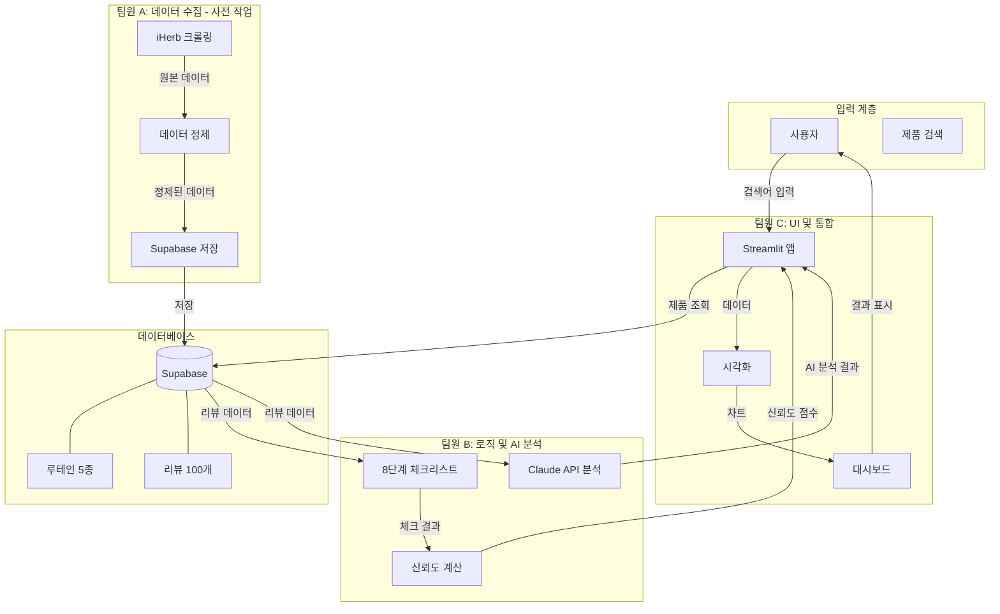
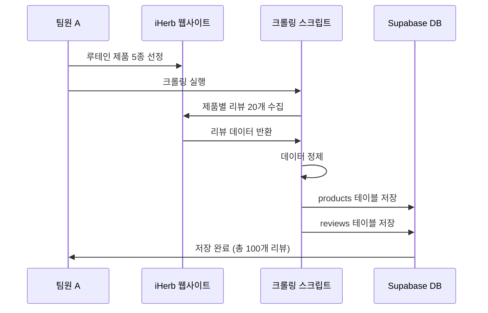
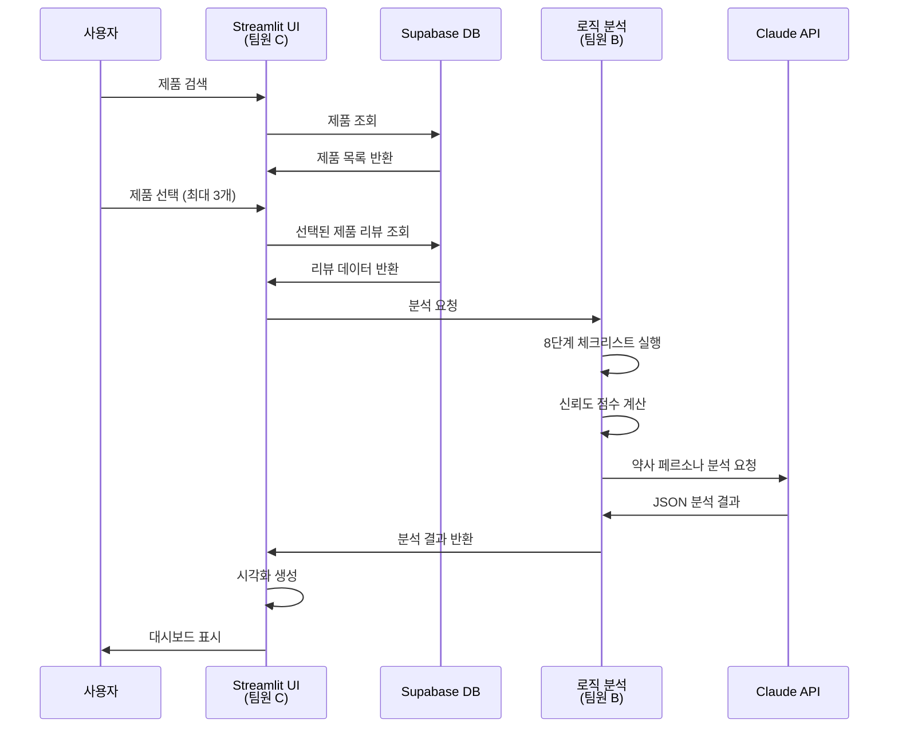

# 건기식 리뷰 팩트체크 시스템 - 전체 프로젝트 개요

## 📖 프로젝트 소개

건기식 제품의 온라인 리뷰를 수집하고, AI를 활용하여 광고성 리뷰를 판별하며, 약사의 시각으로 분석 결과를 제공하는 웹 서비스 **프로토타입**입니다.

### 프로토타입 특징
- **사전 수집 데이터 기반**: 실시간 스크래핑 대신 미리 수집된 데이터베이스 활용
- **제품 카테고리**: 루테인 제품 5종
- **데이터 규모**: 제품당 20개 리뷰 (총 100개)
- **데이터 출처**: iHerb
- **데이터베이스**: Supabase (PostgreSQL)

---

## 👥 팀 구성 및 역할

### 팀원 A: 데이터 수집 및 DB 구축 담당 (Data Manager)
- **목표:** 루테인 제품 5종의 리뷰 데이터를 수집하여 Supabase에 저장
- **주요 작업:** iHerb에서 리뷰 크롤링/수집 → 데이터 정제 → Supabase 테이블 설계 및 저장
- **상세 가이드:** [팀원A_데이터수집_정제_가이드.md](팀원A_데이터수집_정제_가이드.md)

### 팀원 B: 로직 설계 및 AI 분석 담당 (Logic Designer)
- **목표:** 리뷰의 진위여부를 가리고, 약사의 시각으로 요약
- **상세 가이드:** [팀원B_로직설계_AI분석_가이드.md](팀원B_로직설계_AI분석_가이드.md)

### 팀원 C: 화면 구현 및 통합 담당 (UI & Integration)
- **목표:** 결과물을 멋진 웹 대시보드로 보여주기
- **상세 가이드:** [팀원C_화면구현_통합_가이드.md](팀원C_화면구현_통합_가이드.md)

---

## 🏗️ 전체 시스템 아키텍처



---

## 📂 프로젝트 구조

```
개발2팀 과제/
├── docs/                          # 문서 디렉토리
│   ├── 프로젝트_전체_개요.md
│   ├── 팀원A_데이터수집_정제_가이드.md
│   ├── 팀원B_로직설계_AI분석_가이드.md
│   ├── 팀원C_화면구현_통합_가이드.md
│   └── 사용자_시나리오.md
├── data_manager/                  # 팀원 A 작업
│   ├── __init__.py
│   ├── scraper.py                 # iHerb 크롤러 (1회성 데이터 수집용)
│   ├── data_cleaner.py            # 데이터 정제
│   ├── supabase_client.py         # Supabase 클라이언트
│   └── db_uploader.py             # DB 업로드 스크립트
├── logic_designer/                 # 팀원 B 작업
│   ├── __init__.py
│   ├── checklist.py
│   ├── trust_score.py
│   ├── ai_analyzer.py
│   └── config.py
├── ui_integration/                 # 팀원 C 작업 (✅ 완료)
│   ├── __init__.py
│   ├── app.py                     # 메인 Streamlit 앱 (393줄)
│   │   ├── 신뢰도 상위 3개 제품 순위별 표시 (🥇🥈🥉)
│   │   ├── 신뢰도 게이지 차트 (Plotly)
│   │   ├── 레이더 차트 (5개 지표 비교)
│   │   ├── 가격 비교 바 차트
│   │   ├── AI 약사 인사이트 표시
│   │   ├── 8단계 체크리스트 진행률 시각화 (st.progress)
│   │   ├── 리뷰 상세 보기 (광고 의심 리뷰 하이라이트)
│   │   └── "기타 제품" 섹션 (나머지 2개 제품)
│   ├── mock_data.py               # 목업 데이터 (루테인 제품 5종, 리뷰 100개)
│   ├── visualizations.py          # Plotly 차트 컴포넌트 (381줄)
│   │   ├── render_gauge_chart() - 신뢰도 게이지
│   │   ├── render_trust_badge() - 신뢰도 배지
│   │   ├── render_comparison_table() - 비교 테이블
│   │   ├── render_radar_chart() - 레이더 차트
│   │   ├── render_review_sentiment_chart() - 감정 분석 차트
│   │   ├── render_checklist_visual() - 체크리스트 시각화
│   │   └── render_price_comparison_chart() - 가격 비교 차트
│   ├── requirements.txt            # Streamlit, Plotly 의존성
│   ├── README.md                   # UI 구현 설명서
│   └── __pycache__/               # 컴파일된 Python 파일
├── tests/                          # 테스트 코드
│   ├── test_scraper.py
│   ├── test_checklist.py
│   └── test_ui.py
├── requirements.txt                # Python 패키지 의존성
├── .env.example                    # 환경 변수 예시
└── README.md                       # 프로젝트 설명서
```

---

## 🔄 전체 워크플로우

### 사전 데이터 수집 (팀원 A - 1회성 작업)


### 실시간 분석 (사용자 → UI → 분석)


---

## 📊 데이터 흐름

```mermaid
flowchart LR
    subgraph 사전수집[사전 데이터 수집]
        A[iHerb 리뷰<br/>HTML] -->|크롤링| B[리뷰 딕셔너리<br/>List[Dict]]
        B -->|정제| C[정제된 리뷰]
        C -->|업로드| D[(Supabase)]
    end

    subgraph 실시간분석[실시간 분석]
        D -->|조회| E[리뷰 데이터]
        E -->|체크리스트| F[체크 결과<br/>Dict]
        E -->|메타데이터| G[재구매율<br/>사용기간]
        F -->|가중치 적용| H[체크리스트 점수<br/>float]
        H -->|공식 적용| I[신뢰도 점수<br/>0-100]
        G -->|공식 적용| I
        E -->|프롬프트 생성| J[Claude API 요청]
        J -->|JSON 응답| K[AI 분석 결과<br/>Dict]
    end

    subgraph 시각화[시각화]
        I -->|시각화| L[게이지 차트]
        K -->|시각화| M[약사 인사이트]
        I -->|시각화| N[비교 테이블]
        K -->|시각화| N
    end
```

---

## 🛠️ 기술 스택 요약

### 공통
- **Python 3.8+**
- **pandas**: 데이터 처리
- **python-dotenv**: 환경 변수 관리
- **supabase-py**: Supabase Python 클라이언트

### 팀원 A
- **selenium**: 동적 웹 스크래핑 (iHerb 크롤링용)
- **beautifulsoup4**: HTML 파싱
- **supabase-py**: DB 업로드

### 팀원 B
- **anthropic**: Claude API (약사 페르소나 분석)
- **re**: 정규표현식 (내장)
- **collections**: 텍스트 통계 (내장)

### 팀원 C
- **streamlit**: 웹 앱 프레임워크
- **plotly**: 인터랙티브 차트
- **supabase-py**: DB 조회

---

## 📋 개발 단계별 체크리스트

### 1주차: 팀원 A 작업 (데이터 수집 및 DB 구축)
- [ ] 루테인 제품 5종 선정 (iHerb)
- [ ] IHerbScraper 구현 (제품별 리뷰 20개 수집)
- [ ] ReviewCleaner 구현
- [ ] Supabase 프로젝트 생성
- [ ] DB 테이블 설계 (products, reviews)
- [ ] 데이터 업로드 스크립트 구현
- [ ] 총 100개 리뷰 데이터 저장 완료

### 2주차: 팀원 B 작업
- [ ] AdPatternChecker 클래스 구현
- [ ] 8단계 체크리스트 모두 구현 (기획서 반영)
- [ ] ChecklistScorer 구현
- [ ] TrustScoreCalculator 구현
- [ ] 신뢰도 공식 구현 (기획서 반영)
- [ ] PharmacistAnalyzer 구현
- [ ] Claude API 연동
- [ ] 단위 테스트 작성

### 3주차: 팀원 C 작업
- [x] Streamlit 기본 앱 구조
- [x] 검색창 UI 구현
- [x] 메인 화면 레이아웃 구현
- [x] Supabase 조회 클라이언트 구현
- [x] 팀원 B 모듈 통합
- [x] 시각화 컴포넌트 구현
- [x] 3종 비교 기능 구현

### 4주차: 통합 및 테스트
- [ ] 전체 워크플로우 테스트
- [ ] 에러 핸들링 추가
- [ ] UI/UX 개선
- [ ] 성능 최적화
- [ ] 문서화 완료

---

## 🔌 모듈 간 인터페이스

### Supabase 테이블 스키마

#### products 테이블
```sql
CREATE TABLE products (
    id UUID PRIMARY KEY DEFAULT gen_random_uuid(),
    name VARCHAR(255) NOT NULL,
    brand VARCHAR(255),
    price DECIMAL(10, 2),
    serving_size VARCHAR(100),
    servings_per_container INTEGER,
    ingredients JSONB,           -- [{name, amount, daily_value}]
    other_ingredients TEXT[],
    warnings TEXT[],
    product_url TEXT,
    created_at TIMESTAMP DEFAULT NOW()
);
```

#### reviews 테이블
```sql
CREATE TABLE reviews (
    id UUID PRIMARY KEY DEFAULT gen_random_uuid(),
    product_id UUID REFERENCES products(id),
    text TEXT NOT NULL,
    rating INTEGER CHECK (rating >= 1 AND rating <= 5),
    date DATE,
    reorder BOOLEAN DEFAULT FALSE,
    one_month_use BOOLEAN DEFAULT FALSE,
    reviewer VARCHAR(255),
    verified BOOLEAN DEFAULT FALSE,
    created_at TIMESTAMP DEFAULT NOW()
);
```

### Supabase → 팀원 B (리뷰 데이터)
```python
# Supabase 조회 결과 형식
reviews: List[Dict] = [
    {
        'id': str,
        'product_id': str,
        'text': str,
        'rating': int,
        'date': str,
        'reorder': bool,
        'one_month_use': bool,
        'reviewer': str,
        'verified': bool
    },
    ...
]
```

### 팀원 B → 팀원 C
```python
# 팀원 B 출력 형식
analysis_result: Dict = {
    'trust_score': float,        # 0 ~ 100
    'trust_level': str,           # 'high' | 'medium' | 'low'
    'checklist_results': Dict,     # 체크리스트 상세 결과
    'ai_result': {
        'summary': str,
        'efficacy': List[str],
        'side_effects': List[str],
        'recommendations': str,
        'trust_assessment': str,
        'warnings': List[str]
    }
}

# 팀원 C 입력 형식
# 동일한 형식 사용
```

---

## ⚙️ 환경 설정

### 1. Python 가상환경 생성
```bash
python -m venv venv
source venv/bin/activate  # Windows: venv\Scripts\activate
```

### 2. 패키지 설치
```bash
pip install -r requirements.txt
```

### 3. 환경 변수 설정
```bash
cp .env.example .env
```

`.env` 파일에 다음 설정 추가:
```
# Supabase 설정
SUPABASE_URL=https://your-project.supabase.co
SUPABASE_KEY=your-anon-key

# Claude API 설정
ANTHROPIC_API_KEY=your-anthropic-api-key
```

### 4. 실행
```bash
# 팀원 A: 데이터 수집 및 업로드 (1회성)
python data_manager/db_uploader.py

# 팀원 C: Streamlit 앱 실행
streamlit run ui_integration/app.py
```

---

## 📝 requirements.txt

```
# 웹 프레임워크
streamlit>=1.28.0

# 데이터 처리
pandas>=2.0.0
numpy>=1.24.0

# 웹 스크래핑 (팀원 A - 1회성 데이터 수집용)
selenium>=4.15.0
beautifulsoup4>=4.12.0
requests>=2.31.0
lxml>=4.9.0

# 데이터베이스 (공통)
supabase>=2.0.0

# AI 분석 (팀원 B)
anthropic>=0.18.0

# 시각화 (팀원 C)
plotly>=5.17.0
matplotlib>=3.7.0

# 기타
python-dotenv>=1.0.0
```

---

## 🧪 테스트 전략

### 단위 테스트
- 각 모듈별 독립 테스트
- Mock 객체 활용

### 통합 테스트
- 모듈 간 연동 테스트
- 전체 워크플로우 테스트

### 사용자 테스트
- 실제 URL로 테스트
- 다양한 시나리오 테스트

---

## ⚠️ 주의사항

### 1. 웹 스크래핑 윤리 (팀원 A - 1회성 작업)
- robots.txt 준수
- 요청 지연 시간 설정 (2-3초)
- 서버 부하 최소화
- 크롤링은 데이터 수집 시에만 1회 실행

### 2. API 키 보안
- 환경 변수로 관리 (SUPABASE_URL, SUPABASE_KEY, ANTHROPIC_API_KEY)
- 코드에 하드코딩 금지
- Git에 커밋 금지 (.gitignore에 .env 추가)

### 3. 데이터 개인정보
- 리뷰어 정보 익명화 고려
- 개인정보 보호 준수

### 4. 에러 핸들링
- 모든 모듈에 예외 처리
- 사용자 친화적 에러 메시지
- 로깅 기능 추가

### 5. Supabase 주의사항
- Row Level Security (RLS) 설정 권장
- API 키는 anon key 사용 (service_role key는 서버에서만)

---

## 📚 참고 문서

- [팀원 A 가이드](팀원A_데이터수집_정제_가이드.md)
- [팀원 B 가이드](팀원B_로직설계_AI분석_가이드.md)
- [팀원 C 가이드](팀원C_화면구현_통합_가이드.md)

---

## ✅ 현재 구현 상태

### 3주차 완료 현황
**Streamlit UI 목업 구현 완료** (2026-01-03)

#### 구현된 주요 기능
1. **제품 순위 표시**
   - 신뢰도 점수 기준 상위 3개 제품 순위별 표시 (🥇🥈🥉)
   - 각 제품의 신뢰도 점수와 레벨 표시

2. **시각화 컴포넌트**
   - 신뢰도 게이지 차트 (Plotly)
   - 5개 지표 비교 레이더 차트
   - 제품 가격 비교 바 차트
   - 리뷰 감정 분석 차트

3. **약사 인사이트**
   - 요약 (Summary)
   - 효능 (Efficacy)
   - 부작용 (Side Effects)
   - 권장사항 (Recommendations)

4. **인터랙티브 UI**
   - 8단계 체크리스트 진행률 시각화 (st.progress)
   - 리뷰 상세 보기 (광고 의심 리뷰 하이라이트)
   - "기타 제품" 섹션 (나머지 2개 제품)

#### 파일 현황
- `ui_integration/app.py` - 393줄
- `ui_integration/visualizations.py` - 381줄
- `ui_integration/mock_data.py` - 루테인 제품 5종, 리뷰 100개 포함
- `ui_integration/requirements.txt` - Streamlit, Plotly 의존성 정의
- `ui_integration/README.md` - UI 구현 가이드

#### 프로토타입 특징
- 목업 데이터 기반 완전히 동작하는 Streamlit 앱
- Supabase 연동 준비 완료 (mock_data로 현재 운영)
- 팀원 B 로직 모듈 통합 가능한 구조 설계

---

## 🎯 최종 목표 (프로토타입)

1. **사전 데이터 구축**: iHerb 루테인 5종, 총 100개 리뷰를 Supabase에 저장
2. **신뢰할 수 있는 분석**: 8단계 체크리스트와 Claude AI 분석으로 정확한 판별
3. **직관적인 시각화**: 검색 기반 대시보드로 사용자가 쉽게 제품 비교
4. **확장 가능한 구조**: 향후 실시간 스크래핑, 더 많은 제품 카테고리 추가 용이

---

## 📞 협업 가이드

### Git 브랜치 전략
- `main`: 메인 브랜치
- `feature/team-a-*`: 팀원 A 기능
- `feature/team-b-*`: 팀원 B 기능
- `feature/team-c-*`: 팀원 C 기능

### 코드 리뷰
- 각 팀원의 PR은 다른 팀원이 리뷰
- 통합 전 반드시 테스트

### 커뮤니케이션
- 인터페이스 변경 시 사전 협의
- 데이터 형식 변경 시 문서 업데이트

