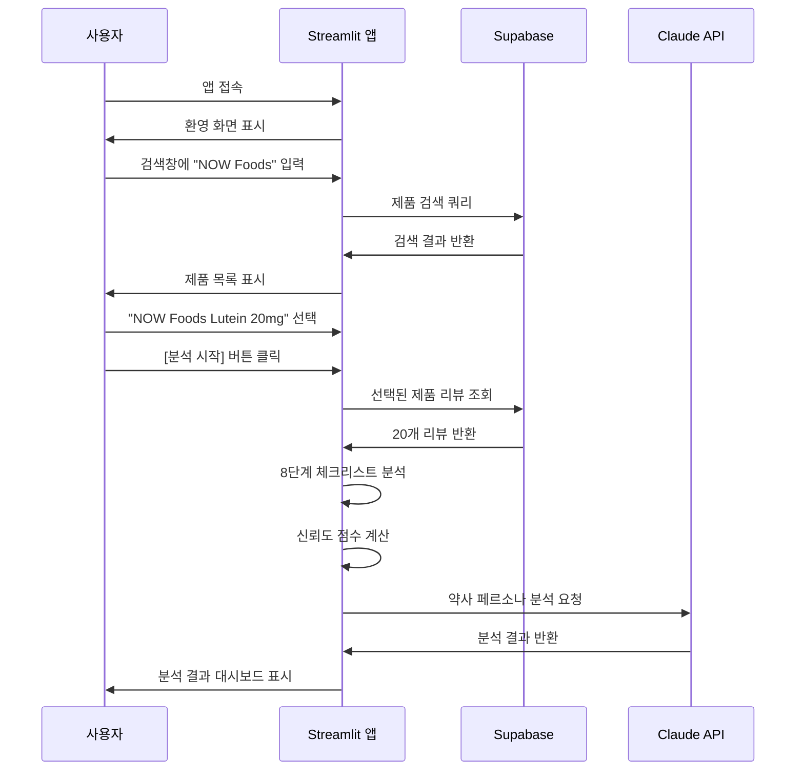
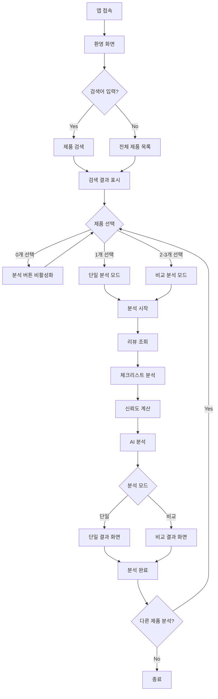

# 사용자 시나리오

## 📖 개요

건기식 리뷰 팩트체크 시스템의 사용자 시나리오 문서입니다. 이 프로토타입은 iHerb의 루테인 제품 5종(총 100개 리뷰)을 기반으로 동작합니다.

---

## 🎯 주요 사용자

| 사용자 유형 | 설명 | 주요 목적 |
|-------------|------|-----------|
| 일반 소비자 | 루테인 제품 구매를 고려하는 사람 | 제품별 리뷰 신뢰도 확인, 광고성 리뷰 식별 |
| 건강 관심자 | 눈 건강에 관심 있는 사용자 | 제품 성분 분석, 효능/부작용 정보 확인 |
| 비교 구매자 | 여러 제품 중 선택하려는 사용자 | 2-3개 제품 비교 분석 |

---

## 📋 시나리오 목록

### 시나리오 1: 단일 제품 분석

**상황:** 사용자가 특정 루테인 제품의 리뷰 신뢰도를 확인하고 싶어함

**사전 조건:**
- Supabase에 5개 루테인 제품과 100개 리뷰가 저장되어 있음
- 사용자가 웹 브라우저로 Streamlit 앱에 접속

**시나리오 흐름:**



**결과:**
- 신뢰도 점수 게이지 차트 (예: 78/100점)
- 신뢰 등급 표시 (High/Medium/Low)
- 광고 의심 리뷰 비율 파이 차트
- 재구매율, 한달 사용자 비율 바 차트
- AI 약사의 성분 분석 및 인사이트

---

### 시나리오 2: 3종 제품 비교 분석

**상황:** 사용자가 루테인 제품 3개를 비교하여 최적의 제품을 선택하고 싶어함

**시나리오 흐름:**

1. **앱 접속 및 검색**
   - 사용자가 앱에 접속
   - 검색창에 "루테인" 또는 "Lutein" 입력
   - 5개 제품 목록이 표시됨

2. **제품 선택 (최대 3개)**
   - 사용자가 아래 3개 제품을 선택:
     - NOW Foods Lutein 20mg
     - Doctor's Best Lutein with Lutemax
     - Jarrow Formulas Lutein 20mg

3. **분석 실행**
   - [분석 시작] 버튼 클릭
   - 진행률 표시 (33% → 66% → 100%)

4. **비교 결과 확인**
   - 3개 제품 카드가 나란히 표시
   - 각 제품의 신뢰도 게이지 차트
   - 비교 테이블 (광고 의심률, 재구매율, 효능, 부작용 등)
   - 레이더 차트로 종합 비교
   - 각 제품별 AI 약사 인사이트 (확장 패널)

---

### 시나리오 3: 광고성 리뷰 식별

**상황:** 사용자가 특정 제품의 광고성 리뷰를 직접 확인하고 싶어함

**시나리오 흐름:**

1. 제품 선택 후 분석 실행
2. 결과 화면에서 "광고 의심 리뷰 하이라이트" 옵션 활성화
3. 리뷰 목록에서 광고 의심 리뷰가 하이라이트 표시
4. 각 리뷰 옆에 체크리스트 결과 요약 표시:
   - 과도한 긍정어 ✓
   - 반복 패턴 ✓
   - 짧은 리뷰 ✗
   - 구체성 부족 ✓

---

## 🖥️ 화면별 상세 시나리오

### 화면 1: 메인 화면 (환영 페이지)

**표시 내용:**
- 서비스 제목: "건기식 리뷰 팩트체크"
- 서비스 설명: "루테인 제품 리뷰 분석 시스템"
- 안내 메시지: "사이드바에서 제품을 검색하고 선택한 후 분석을 시작하세요."
- 등록된 제품 목록 (5개)

**사용자 액션:**
- 사이드바 검색창 사용
- 제품 선택

---

### 화면 2: 사이드바

**구성 요소:**

1. **검색창**
   - 플레이스홀더: "루테인 검색..."
   - 실시간 검색 결과 필터링

2. **제품 선택 (멀티셀렉트)**
   - 최대 3개 선택 가능
   - 선택된 제품 수 표시: "✅ 2개 제품 선택됨"

3. **옵션**
   - 광고 의심 리뷰 하이라이트 (체크박스)

4. **분석 시작 버튼**
   - 제품 미선택 시 비활성화
   - 클릭 시 분석 프로세스 시작

---

### 화면 3: 분석 진행 중

**표시 내용:**
- 진행률 바 (Progress Bar)
- 상태 메시지:
  - "📦 NOW Foods Lutein 분석 중... (1/3)"
  - "리뷰 조회 중..."
  - "광고 패턴 분석 중..."
  - "AI 약사 분석 중..."

---

### 화면 4: 단일 제품 결과

**레이아웃:**

```
┌─────────────────────────────────────────────┐
│ 📊 NOW Foods Lutein 20mg 분석 결과          │
├─────────────────────────────────────────────┤
│                                             │
│         ┌─────────────────┐                 │
│         │   게이지 차트    │                 │
│         │    78 / 100     │                 │
│         │   신뢰도: HIGH   │                 │
│         └─────────────────┘                 │
│         20개 리뷰 분석                       │
│                                             │
├─────────────────────────────────────────────┤
│ 📋 상세 분석                                 │
│ ┌─────────────────────────────────────────┐ │
│ │ 항목            │ 결과                  │ │
│ │ 광고 의심 비율   │ 15%                   │ │
│ │ 재구매율        │ 65%                   │ │
│ │ 한달사용 비율   │ 45%                   │ │
│ │ 평균 평점       │ 4.2 / 5              │ │
│ └─────────────────────────────────────────┘ │
│                                             │
├─────────────────────────────────────────────┤
│ 💊 AI 약사의 인사이트                        │
│                                             │
│ [요약]                                       │
│ 루테인 20mg은 눈 건강에 효과적인 성분입니다... │
│                                             │
│ [좋은 성분]                                  │
│ - 루테인 20mg: 황반변성 예방에 효과적         │
│ - 제아잔틴 1mg: 루테인과 시너지 효과          │
│                                             │
│ [주의사항]                                   │
│ - 임산부는 복용 전 전문가 상담 권장           │
│                                             │
└─────────────────────────────────────────────┘
```

---

### 화면 5: 3종 비교 결과

**레이아웃:**

```
┌─────────────────────────────────────────────────────────┐
│ 🔍 루테인 제품 비교 분석 리포트                           │
├──────────────┬──────────────┬──────────────────────────┤
│ NOW Foods    │ Doctor's Best│ Jarrow Formulas          │
│ 게이지 78점  │ 게이지 82점  │ 게이지 71점              │
│ HIGH         │ HIGH         │ MEDIUM                   │
│ 20개 리뷰    │ 20개 리뷰    │ 20개 리뷰                │
├──────────────┴──────────────┴──────────────────────────┤
│ 📋 팩트체크 상세 비교                                    │
│ ┌─────────────────────────────────────────────────────┐ │
│ │ 항목          │ NOW Foods │ Doctor's │ Jarrow      │ │
│ │ 광고 의심     │ 15%       │ 10%      │ 25%         │ │
│ │ 재구매율      │ 65%       │ 75%      │ 55%         │ │
│ │ 한달사용      │ 45%       │ 60%      │ 35%         │ │
│ │ 평균 평점     │ 4.2       │ 4.5      │ 3.9         │ │
│ └─────────────────────────────────────────────────────┘ │
│                                                         │
│ 📊 레이더 차트                                           │
│         신뢰도                                          │
│           ∧                                             │
│          / \                                            │
│    가격 /   \ 재구매                                     │
│         \   /                                           │
│          \ /                                            │
│       효능 ∨ 사용기간                                    │
│                                                         │
│ 💊 AI 약사의 심층 비교 리포트                             │
│ ▸ NOW Foods (NOW Foods) 상세 분석                       │
│ ▸ Doctor's Best (Doctor's Best) 상세 분석               │
│ ▸ Jarrow Formulas (Jarrow) 상세 분석                    │
└─────────────────────────────────────────────────────────┘
```

---

## 🔄 사용자 플로우 다이어그램



---

## ⚠️ 예외 상황 처리

### 1. 데이터베이스 연결 실패
- **상황:** Supabase 연결 오류
- **처리:** 에러 메시지 표시 "데이터베이스 연결에 실패했습니다. 잠시 후 다시 시도해주세요."

### 2. 제품에 리뷰가 없는 경우
- **상황:** 선택된 제품에 리뷰 데이터가 없음
- **처리:** 경고 메시지 표시 "{제품명}: 리뷰가 없습니다."

### 3. AI 분석 API 오류
- **상황:** Claude API 호출 실패
- **처리:** 체크리스트 분석 결과만 표시, AI 인사이트 섹션에 "AI 분석을 불러올 수 없습니다." 표시

### 4. 검색 결과 없음
- **상황:** 검색어와 일치하는 제품 없음
- **처리:** "검색 결과가 없습니다. 다른 검색어를 시도해보세요." 표시

---

## 📊 프로토타입 데이터 사양

| 항목 | 값 |
|------|-----|
| 제품 수 | 5개 (루테인) |
| 제품당 리뷰 수 | 20개 |
| 총 리뷰 수 | 100개 |
| 데이터 출처 | iHerb |
| 데이터베이스 | Supabase |

---

## 🧪 테스트 시나리오

### 기능 테스트

1. **검색 기능**
   - [ ] 빈 검색어 → 전체 제품 표시
   - [ ] "NOW" 검색 → NOW Foods 제품만 표시
   - [ ] 존재하지 않는 검색어 → 결과 없음 메시지

2. **제품 선택**
   - [ ] 0개 선택 → 분석 버튼 비활성화
   - [ ] 1개 선택 → 단일 분석 모드
   - [ ] 3개 선택 → 비교 분석 모드
   - [ ] 4개 이상 선택 시도 → 선택 불가

3. **분석 결과**
   - [ ] 신뢰도 점수가 0-100 사이
   - [ ] 레벨이 high/medium/low 중 하나
   - [ ] 차트가 정상 렌더링

### 성능 테스트

- [ ] 단일 제품 분석: 10초 이내
- [ ] 3종 비교 분석: 30초 이내

---

## 📚 관련 문서

- [프로젝트 전체 개요](프로젝트_전체_개요.md)
- [팀원 A 가이드](팀원A_데이터수집_정제_가이드.md)
- [팀원 B 가이드](팀원B_로직설계_AI분석_가이드.md)
- [팀원 C 가이드](팀원C_화면구현_통합_가이드.md)
