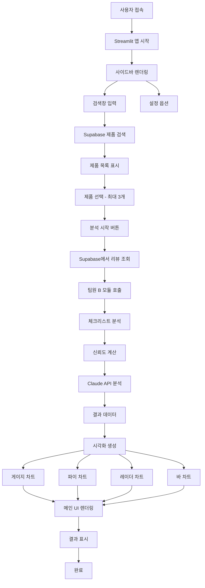
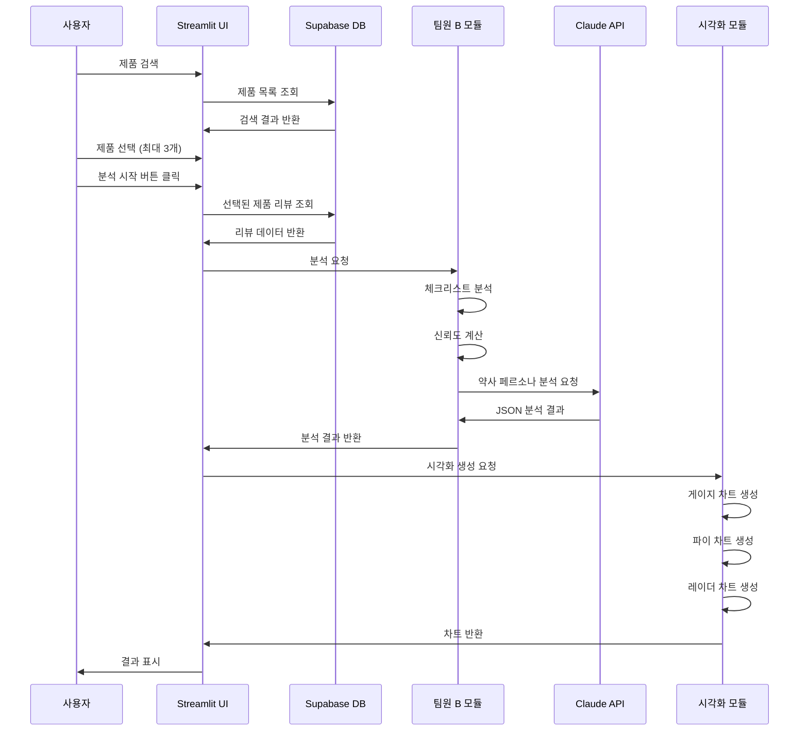

# 팀원 C: 화면 구현 및 통합 담당 가이드

## 📋 역할 개요

**목표:** "결과물을 멋진 웹 대시보드로 보여준다."

Supabase에 저장된 루테인 제품 데이터를 조회하고, 팀원 B(로직 설계 및 AI 분석)가 만든 분석 기능을 연결하여 하나의 Streamlit 웹 서비스로 통합하고, 게이지 차트, 파이 차트 등을 활용해 신뢰도를 시각화하는 역할을 담당합니다.

---

## 🎯 상세 미션

### 1. Supabase 연동 및 팀원 B 기능 통합
- Supabase에서 제품/리뷰 데이터 조회
- 로직 분석 모듈 연결
- 전체 워크플로우 구현

### 2. Streamlit 웹 서비스 구현
- 사이드바: **검색창**, 제품 선택, 설정 옵션
- 메인 화면: 분석 결과 표시
- 3종 비교 기능

### 3. 시각화 구현
- 게이지 차트 (신뢰도 점수)
- 파이 차트 (광고 의심 비율 등)
- 레이더 차트 (3종 비교)
- 바 차트 (재구매율, 사용기간 등)

---

## 🏗️ 시스템 아키텍처



---

## 📁 파일 구조

```
ui_integration/
├── __init__.py              # 패키지 초기화
├── app.py                   # Streamlit 메인 앱
│   ├── main()              # 메인 함수
│   ├── render_sidebar()    # 사이드바 렌더링 (검색창 포함)
│   ├── render_main()       # 메인 화면 렌더링
│   └── run_analysis()      # 분석 실행 함수
├── db_client.py             # Supabase 조회 클라이언트
│   ├── get_all_products()   # 전체 제품 조회
│   ├── search_products()    # 제품 검색
│   └── get_reviews()        # 제품별 리뷰 조회
├── components.py            # 재사용 가능한 UI 컴포넌트
│   ├── render_trust_gauge() # 신뢰도 게이지
│   ├── render_product_card() # 제품 카드
│   ├── render_comparison_table() # 비교 테이블
│   └── render_pharmacist_insight() # 약사 인사이트
├── visualizations.py        # 차트 및 시각화 함수
│   ├── create_gauge_chart() # 게이지 차트
│   ├── create_pie_chart()   # 파이 차트
│   ├── create_radar_chart() # 레이더 차트
│   ├── create_bar_chart()   # 바 차트
│   └── create_comparison_chart() # 비교 차트
└── utils.py                 # UI 유틸리티
    ├── format_number()      # 숫자 포맷팅
    ├── get_color_by_level() # 신뢰도별 색상
    └── validate_inputs()    # 입력 검증
```

---

## 🔧 기술 스택

- **웹 프레임워크:**
  - `streamlit` (1.28.0+): 웹 앱 프레임워크

- **데이터베이스:**
  - `supabase` (2.0.0+): Supabase Python 클라이언트

- **시각화:**
  - `plotly` (5.17.0+): 인터랙티브 차트
  - `matplotlib` (3.7.0+): 기본 차트 (선택)

- **데이터 처리:**
  - `pandas` (2.0.0+): 데이터 조작

- **기타:**
  - `python-dotenv` (1.0.0+): 환경 변수 관리
  - `streamlit-option-menu`: 메뉴 컴포넌트 (선택)
  - `streamlit-aggrid`: 고급 테이블 (선택)

---

## 📝 주요 함수 설계

### 1. `db_client.py` (Supabase 조회 클라이언트)

```python
# ui_integration/db_client.py
import os
from supabase import create_client, Client
from dotenv import load_dotenv
from typing import List, Dict, Optional

load_dotenv()

class DBClient:
    """Supabase 조회 클라이언트"""

    def __init__(self):
        url = os.getenv("SUPABASE_URL")
        key = os.getenv("SUPABASE_KEY")
        self.client: Client = create_client(url, key)

    def get_all_products(self) -> List[Dict]:
        """전체 제품 목록 조회"""
        response = self.client.table('products').select('*').execute()
        return response.data

    def search_products(self, keyword: str) -> List[Dict]:
        """
        제품 검색 (이름 기준)

        Args:
            keyword: 검색 키워드

        Returns:
            List[Dict]: 검색된 제품 목록
        """
        if not keyword.strip():
            return self.get_all_products()

        response = self.client.table('products')\
            .select('*')\
            .ilike('name', f'%{keyword}%')\
            .execute()
        return response.data

    def get_reviews_by_product(self, product_id: str) -> List[Dict]:
        """
        제품별 리뷰 조회

        Args:
            product_id: 제품 UUID

        Returns:
            List[Dict]: 리뷰 목록
        """
        response = self.client.table('reviews')\
            .select('*')\
            .eq('product_id', product_id)\
            .execute()
        return response.data

    def get_product_with_reviews(self, product_id: str) -> Dict:
        """
        제품 정보와 리뷰를 함께 조회

        Returns:
            Dict: {'product': {...}, 'reviews': [...]}
        """
        product = self.client.table('products')\
            .select('*')\
            .eq('id', product_id)\
            .single()\
            .execute()

        reviews = self.get_reviews_by_product(product_id)

        return {
            'product': product.data,
            'reviews': reviews
        }
```

### 2. `app.py`

#### `main()`
```python
def main():
    """Streamlit 메인 함수"""
    st.set_page_config(
        page_title="건기식 리뷰 팩트체크",
        page_icon="🔍",
        layout="wide"
    )

    # 사이드바 렌더링
    sidebar_data = render_sidebar()

    # 메인 화면 렌더링
    if sidebar_data.get('analyze_clicked'):
        run_analysis(sidebar_data)
    else:
        render_welcome_screen()
```

#### `render_sidebar()`
```python
def render_sidebar() -> Dict:
    """
    사이드바 렌더링 (검색창 기반)

    Returns:
        Dict: 사용자 입력 데이터
        {
            'selected_products': [product1, product2, ...],
            'filter_ads': True,
            'analyze_clicked': bool
        }
    """
    from ui_integration.db_client import DBClient

    db = DBClient()

    with st.sidebar:
        st.title("🔍 분석 설정")

        # 검색창
        search_keyword = st.text_input(
            "제품 검색",
            placeholder="루테인 검색...",
            help="제품명으로 검색하세요"
        )

        # 제품 검색 및 목록 표시
        products = db.search_products(search_keyword)

        if not products:
            st.warning("등록된 제품이 없습니다.")
            return {'analyze_clicked': False}

        # 제품 선택 (멀티셀렉트)
        product_options = {p['name']: p for p in products}
        selected_names = st.multiselect(
            "분석할 제품 선택 (최대 3개)",
            options=list(product_options.keys()),
            max_selections=3,
            help="비교 분석하려면 2-3개 선택"
        )

        selected_products = [product_options[name] for name in selected_names]

        st.divider()

        # 필터 옵션
        filter_ads = st.checkbox("광고 의심 리뷰 하이라이트", value=True)

        # 분석 시작 버튼
        analyze_clicked = st.button(
            "🔬 분석 시작",
            type="primary",
            use_container_width=True,
            disabled=len(selected_products) == 0
        )

        # 선택된 제품 수 표시
        if selected_products:
            st.caption(f"✅ {len(selected_products)}개 제품 선택됨")

        return {
            'selected_products': selected_products,
            'filter_ads': filter_ads,
            'analyze_clicked': analyze_clicked
        }
```

#### `run_analysis()`
```python
def run_analysis(sidebar_data: Dict):
    """
    분석 실행 및 결과 표시

    Args:
        sidebar_data: 사이드바에서 받은 입력 데이터
    """
    from ui_integration.db_client import DBClient
    from logic_designer.checklist import AdPatternChecker
    from logic_designer.trust_score import TrustScoreCalculator
    from logic_designer.ai_analyzer import PharmacistAnalyzer

    selected_products = sidebar_data.get('selected_products', [])

    if not selected_products:
        st.error("최소 1개 이상의 제품을 선택해주세요.")
        return

    db = DBClient()

    # 진행 상황 표시
    progress_bar = st.progress(0)
    status_text = st.empty()

    results = []

    for idx, product in enumerate(selected_products):
        product_name = product['name']
        status_text.info(f"📦 {product_name} 분석 중... ({idx+1}/{len(selected_products)})")

        # Supabase에서 리뷰 조회
        progress_bar.progress((idx * 3 + 1) / (len(selected_products) * 3))
        reviews = db.get_reviews_by_product(product['id'])

        if not reviews:
            st.warning(f"{product_name}: 리뷰가 없습니다.")
            continue

        # 팀원 B: 체크리스트 분석
        progress_bar.progress((idx * 3 + 2) / (len(selected_products) * 3))

        checker = AdPatternChecker()
        checklist_results = [checker.check_all_patterns(r) for r in reviews]

        # 신뢰도 계산
        trust_calc = TrustScoreCalculator()
        trust_result = trust_calc.calculate(reviews, checklist_results)

        # AI 분석
        progress_bar.progress((idx * 3 + 3) / (len(selected_products) * 3))
        analyzer = PharmacistAnalyzer()
        ai_result = analyzer.analyze(reviews, product)

        results.append({
            'product': product,
            'reviews': reviews,
            'trust_score': trust_result['score'],
            'trust_level': trust_result['level'],
            'checklist_results': checklist_results,
            'ai_result': ai_result
        })

    # 결과 표시
    progress_bar.progress(1.0)
    status_text.success("✅ 분석 완료!")

    if len(results) == 1:
        render_single_result(results[0])
    else:
        render_comparison_results(results)
```

### 3. `components.py`

#### `render_trust_gauge()`
```python
def render_trust_gauge(score: float, level: str, size: int = 200):
    """
    신뢰도 게이지 차트 렌더링
    
    Args:
        score: 신뢰도 점수 (0 ~ 100)
        level: 신뢰도 등급 ('high' | 'medium' | 'low')
        size: 차트 크기
    """
    fig = create_gauge_chart(score, level, size)
    st.plotly_chart(fig, use_container_width=True)
```

#### `render_product_card()`
```python
def render_product_card(product_data: Dict):
    """
    제품 카드 컴포넌트 렌더링
    
    Args:
        product_data: {
            'name': '제품명',
            'trust_score': 85,
            'trust_level': 'high',
            'review_count': 127,
            'badge': '가장 정직한 리뷰'
        }
    """
    col1, col2, col3 = st.columns([1, 2, 1])
    
    with col2:
        st.markdown(f"### {product_data['name']}")
        render_trust_gauge(
            product_data['trust_score'],
            product_data['trust_level']
        )
        st.caption(f"{product_data['review_count']}개 리뷰 분석")
```

#### `render_comparison_table()`
```python
def render_comparison_table(products: List[Dict]):
    """
    비교 테이블 렌더링
    
    Args:
        products: 제품 분석 결과 리스트
    """
    # 테이블 데이터 구성
    table_data = {
        '비교 항목': [
            '광고 의심 비율',
            '핵심 체감 효능',
            '주요 부작용 리포트',
            '실제 재구매율',
            '한 달 이상 사용자 비율',
            '포토 리뷰 비율'
        ]
    }
    
    for idx, product in enumerate(products):
        table_data[f'제품 {idx+1}'] = [
            f"{product['ad_suspicion_rate']:.1f}%",
            format_efficacy(product['efficacy']),
            format_side_effects(product['side_effects']),
            f"{product['reorder_rate']:.1f}%",
            f"{product['usage_period_rate']:.1f}%",
            f"{product['photo_review_rate']:.1f}%"
        ]
    
    df = pd.DataFrame(table_data)
    st.dataframe(df, use_container_width=True, hide_index=True)
```

### 3. `visualizations.py`

#### `create_gauge_chart()`
```python
import plotly.graph_objects as go

def create_gauge_chart(score: float, level: str, size: int = 200) -> go.Figure:
    """
    게이지 차트 생성
    
    Args:
        score: 신뢰도 점수 (0 ~ 100)
        level: 신뢰도 등급
        size: 차트 크기
    
    Returns:
        go.Figure: Plotly Figure 객체
    """
    # 색상 설정
    colors = {
        'high': '#10b981',
        'medium': '#f59e0b',
        'low': '#ef4444'
    }
    color = colors.get(level, '#666')
    
    # 게이지 각도 계산
    angle = (score / 100) * 360
    
    fig = go.Figure(go.Indicator(
        mode="gauge+number",
        value=score,
        domain={'x': [0, 1], 'y': [0, 1]},
        title={'text': "신뢰도 점수"},
        gauge={
            'axis': {'range': [None, 100]},
            'bar': {'color': color},
            'steps': [
                {'range': [0, 50], 'color': "lightgray"},
                {'range': [50, 70], 'color': "gray"}
            ],
            'threshold': {
                'line': {'color': "red", 'width': 4},
                'thickness': 0.75,
                'value': 90
            }
        }
    ))
    
    fig.update_layout(height=size, margin=dict(l=20, r=20, t=40, b=20))
    return fig
```

#### `create_pie_chart()`
```python
def create_pie_chart(data: Dict, title: str = "") -> go.Figure:
    """
    파이 차트 생성
    
    Args:
        data: {
            'labels': ['항목1', '항목2', ...],
            'values': [값1, 값2, ...],
            'colors': ['색상1', '색상2', ...]
        }
        title: 차트 제목
    """
    fig = go.Figure(data=[go.Pie(
        labels=data['labels'],
        values=data['values'],
        hole=0.3,
        marker_colors=data.get('colors', None)
    )])
    
    fig.update_traces(
        textposition='inside',
        textinfo='percent+label'
    )
    
    fig.update_layout(
        title=title,
        showlegend=True
    )
    
    return fig
```

#### `create_radar_chart()`
```python
def create_radar_chart(products: List[Dict]) -> go.Figure:
    """
    레이더 차트 생성 (3종 비교)
    
    Args:
        products: 제품 분석 결과 리스트
    
    Returns:
        go.Figure: Plotly 레이더 차트
    """
    categories = [
        '신뢰도',
        '재구매율',
        '사용기간',
        '효능',
        '가격대비'
    ]
    
    fig = go.Figure()
    
    colors = ['#3b82f6', '#ef4444', '#10b981']
    
    for idx, product in enumerate(products):
        values = [
            product['trust_score'] / 100 * 10,
            product['reorder_rate'] / 100 * 10,
            product['usage_period_rate'] / 100 * 10,
            product.get('efficacy_score', 7),
            product.get('value_score', 7)
        ]
        
        fig.add_trace(go.Scatterpolar(
            r=values,
            theta=categories,
            fill='toself',
            name=f"제품 {idx+1}",
            line_color=colors[idx % len(colors)]
        ))
    
    fig.update_layout(
        polar=dict(
            radialaxis=dict(
                visible=True,
                range=[0, 10]
            )
        ),
        showlegend=True,
        title="3종 비교 레이더 차트"
    )
    
    return fig
```

#### `create_bar_chart()`
```python
def create_bar_chart(data: Dict, title: str = "") -> go.Figure:
    """
    바 차트 생성
    
    Args:
        data: {
            'x': ['항목1', '항목2', ...],
            'y': [값1, 값2, ...],
            'colors': ['색상1', '색상2', ...]
        }
        title: 차트 제목
    """
    fig = go.Figure(data=[
        go.Bar(
            x=data['x'],
            y=data['y'],
            marker_color=data.get('colors', '#2563eb')
        )
    ])
    
    fig.update_layout(
        title=title,
        xaxis_title="항목",
        yaxis_title="값"
    )
    
    return fig
```

---

## 🔄 전체 워크플로우



---

## 🎨 UI 레이아웃 설계

### 메인 레이아웃 구조

```
┌─────────────────────────────────────────────────┐
│  사이드바 (고정)  │  메인 콘텐츠 영역            │
│                  │                              │
│  🔍 분석 설정     │  📊 분석 결과                 │
│                  │                              │
│  제품 검색       │  ┌────────────────────────┐  │
│  [검색창    🔍]  │  │  제품 카드 (3개)        │  │
│                  │  │  [게이지] [게이지] [게이지]│  │
│  제품 선택       │  └────────────────────────┘  │
│  ☑ NOW Foods    │                              │
│  ☑ Doctor's Best│  ┌────────────────────────┐  │
│  ☐ Jarrow       │  │  비교 테이블            │  │
│                  │  └────────────────────────┘  │
│  ──────────     │                              │
│  필터 옵션       │  ┌────────────────────────┐  │
│  [체크박스]      │  │  약사 인사이트          │  │
│                  │  └────────────────────────┘  │
│  [🔬 분석 시작]  │                              │
│                  │  ┌────────────────────────┐  │
│  ✅ 2개 제품 선택│  │  레이더 차트            │  │
│                  │  └────────────────────────┘  │
└─────────────────────────────────────────────────┘
```

---

## 🛠️ 구현 가이드

### 1단계: 기본 Streamlit 앱 구조

```python
# ui_integration/app.py
import streamlit as st
import sys
import os

# 상위 디렉토리 경로 추가
sys.path.append(os.path.dirname(os.path.dirname(os.path.abspath(__file__))))

from ui_integration.db_client import DBClient
from logic_designer.checklist import AdPatternChecker
from logic_designer.trust_score import TrustScoreCalculator
from logic_designer.ai_analyzer import PharmacistAnalyzer

def main():
    st.set_page_config(
        page_title="건기식 리뷰 팩트체크",
        page_icon="🔍",
        layout="wide",
        initial_sidebar_state="expanded"
    )

    # 커스텀 CSS
    st.markdown("""
    <style>
    .main {
        padding: 2rem;
    }
    .stButton>button {
        width: 100%;
    }
    </style>
    """, unsafe_allow_html=True)

    sidebar_data = render_sidebar()

    if sidebar_data.get('analyze_clicked'):
        run_analysis(sidebar_data)
    else:
        render_welcome_screen()


def render_welcome_screen():
    """환영 화면 렌더링"""
    st.title("🔍 건기식 리뷰 팩트체크")
    st.markdown("### 루테인 제품 리뷰 분석 시스템")
    st.info("👈 사이드바에서 제품을 검색하고 선택한 후 분석을 시작하세요.")

    # 데이터베이스 상태 표시
    db = DBClient()
    products = db.get_all_products()

    st.markdown("---")
    st.markdown("#### 📦 등록된 제품")

    if products:
        for product in products:
            st.markdown(f"- **{product['name']}** ({product['brand']})")
    else:
        st.warning("등록된 제품이 없습니다. 팀원 A에게 데이터 업로드를 요청하세요.")


if __name__ == "__main__":
    main()
```

### 2단계: 분석 실행 함수

```python
def run_analysis(sidebar_data: Dict):
    """분석 실행 (Supabase 기반)"""
    from ui_integration.db_client import DBClient

    selected_products = sidebar_data.get('selected_products', [])

    if not selected_products:
        st.error("❌ 최소 1개 이상의 제품을 선택해주세요.")
        return

    db = DBClient()

    # 진행 상황 표시
    progress_container = st.container()
    with progress_container:
        progress_bar = st.progress(0)
        status_text = st.empty()

    results = []

    try:
        for idx, product in enumerate(selected_products):
            product_name = product['name']
            status_text.info(f"📦 {product_name} 분석 중... ({idx+1}/{len(selected_products)})")

            # Supabase에서 리뷰 조회
            progress = (idx * 3 + 1) / (len(selected_products) * 3)
            progress_bar.progress(progress)

            with st.spinner("리뷰 조회 중..."):
                reviews = db.get_reviews_by_product(product['id'])

            if not reviews:
                st.warning(f"{product_name}: 리뷰가 없습니다.")
                continue

            # 팀원 B: 체크리스트 분석
            progress = (idx * 3 + 2) / (len(selected_products) * 3)
            progress_bar.progress(progress)

            with st.spinner("광고 패턴 분석 중..."):
                checker = AdPatternChecker()
                checklist_results = [checker.check_all_patterns(r) for r in reviews]

            with st.spinner("신뢰도 계산 중..."):
                trust_calc = TrustScoreCalculator()
                trust_result = trust_calc.calculate(reviews, checklist_results)

            # 팀원 B: AI 분석
            progress = (idx * 3 + 3) / (len(selected_products) * 3)
            progress_bar.progress(progress)

            with st.spinner("AI 약사 분석 중..."):
                analyzer = PharmacistAnalyzer()
                ai_result = analyzer.analyze(reviews, product)

            # 결과 저장
            results.append({
                'product': product,
                'reviews': reviews,
                'trust_score': trust_result['score'],
                'trust_level': trust_result['level'],
                'checklist_results': checklist_results,
                'ai_result': ai_result
            })

        # 진행 상황 완료
        progress_bar.progress(1.0)
        status_text.success("✅ 분석 완료!")

        # 결과 표시
        if len(results) == 1:
            render_single_result(results[0])
        else:
            render_comparison_results(results)

    except Exception as e:
        st.error(f"❌ 오류 발생: {str(e)}")
        st.exception(e)
```

### 3단계: 결과 표시 함수

```python
def render_single_result(result: Dict):
    """단일 제품 결과 표시"""
    product = result['product']

    st.header(f"📊 {product['name']} 분석 결과")

    # 제품 카드
    col1, col2, col3 = st.columns([1, 2, 1])
    with col2:
        render_product_card({
            'name': product['name'],
            'brand': product['brand'],
            'trust_score': result['trust_score'],
            'trust_level': result['trust_level'],
            'review_count': len(result['reviews'])
        })

    # 상세 비교 테이블
    st.subheader("📋 상세 분석")
    render_comparison_table([result])

    # 약사 인사이트
    st.subheader("💊 AI 약사의 인사이트")
    render_pharmacist_insight(result['ai_result'])


def render_comparison_results(results: List[Dict]):
    """3종 비교 결과 표시"""
    st.header("🔍 루테인 제품 비교 분석 리포트")

    # 제품 카드
    cols = st.columns(len(results))
    for idx, (col, result) in enumerate(zip(cols, results)):
        product = result['product']
        with col:
            render_product_card({
                'name': product['name'],
                'brand': product['brand'],
                'trust_score': result['trust_score'],
                'trust_level': result['trust_level'],
                'review_count': len(result['reviews'])
            })

    # 비교 테이블
    st.subheader("📋 팩트체크 상세 비교")
    render_comparison_table(results)

    # 약사 인사이트
    st.subheader("💊 AI 약사의 심층 비교 리포트")
    for result in results:
        product = result['product']
        with st.expander(f"{product['name']} ({product['brand']}) 상세 분석"):
            render_pharmacist_insight(result['ai_result'])

    # 레이더 차트
    st.subheader("📊 신뢰도-효능-가격 비교")
    radar_fig = create_radar_chart(results)
    st.plotly_chart(radar_fig, use_container_width=True)
```

---

## 🎨 시각화 예시 코드

### 게이지 차트 상세 구현

```python
# ui_integration/visualizations.py
import plotly.graph_objects as go

def create_gauge_chart(score: float, level: str, size: int = 200) -> go.Figure:
    """게이지 차트 생성"""
    # 색상 설정
    color_map = {
        'high': '#10b981',
        'medium': '#f59e0b',
        'low': '#ef4444'
    }
    color = color_map.get(level, '#666')
    
    fig = go.Figure(go.Indicator(
        mode="gauge+number+delta",
        value=score,
        domain={'x': [0, 1], 'y': [0, 1]},
        title={'text': "신뢰도 점수", 'font': {'size': 20}},
        delta={'reference': 50},
        gauge={
            'axis': {'range': [None, 100], 'tickwidth': 1},
            'bar': {'color': color},
            'steps': [
                {'range': [0, 50], 'color': "lightgray"},
                {'range': [50, 70], 'color': "gray"}
            ],
            'threshold': {
                'line': {'color': "red", 'width': 4},
                'thickness': 0.75,
                'value': 90
            }
        }
    ))
    
    fig.update_layout(
        height=size,
        margin=dict(l=20, r=20, t=40, b=20),
        font={'color': "darkblue", 'family': "Arial"}
    )
    
    return fig
```

---

## ⚠️ 주의사항 및 베스트 프랙티스

### 1. Streamlit 성능
- **캐싱 활용:** `@st.cache_data` 데코레이터로 데이터 캐싱
- **세션 상태:** 사용자 입력 상태 관리
- **비동기 처리:** 긴 작업은 백그라운드 처리 고려

### 2. 에러 핸들링
- **입력 검증:** URL 형식, 빈 값 체크
- **예외 처리:** 각 모듈 호출 시 try-except
- **사용자 피드백:** 명확한 에러 메시지

### 3. UI/UX
- **로딩 표시:** 진행 상황 표시
- **반응형 디자인:** 다양한 화면 크기 대응
- **접근성:** 색상 대비, 텍스트 크기 고려

### 4. 모듈 통합
- **의존성 관리:** 상대 경로, 절대 경로 명확히
- **데이터 형식:** 모듈 간 데이터 형식 통일
- **로깅:** 디버깅을 위한 로그 추가

---

## 🧪 테스트 예시

```python
# tests/test_ui.py
import streamlit as st
from ui_integration.components import render_trust_gauge
from ui_integration.visualizations import create_gauge_chart

def test_gauge_chart():
    fig = create_gauge_chart(85, 'high')
    assert fig is not None
    assert len(fig.data) > 0
```

---

## 📚 참고 자료

- [Streamlit 공식 문서](https://docs.streamlit.io/)
- [Plotly Python 문서](https://plotly.com/python/)
- [Streamlit 컴포넌트](https://streamlit.io/components)

---

## ✅ 체크리스트

- [ ] Streamlit 기본 앱 구조 구현
- [ ] db_client.py 구현 (Supabase 조회)
- [ ] 검색창 UI 구현
- [ ] 제품 선택 (멀티셀렉트) 구현
- [ ] 메인 화면 레이아웃 구현
- [ ] Supabase 연동 테스트
- [ ] 팀원 B 모듈 통합
- [ ] 게이지 차트 구현
- [ ] 파이 차트 구현
- [ ] 레이더 차트 구현
- [ ] 바 차트 구현
- [ ] 비교 테이블 구현
- [ ] 약사 인사이트 섹션 구현
- [ ] 3종 비교 기능 구현
- [ ] 에러 핸들링 추가
- [ ] 로딩 상태 표시
- [ ] 반응형 디자인 적용

---

## 🚀 실행 방법

```bash
# Streamlit 앱 실행
streamlit run ui_integration/app.py

# 또는 포트 지정
streamlit run ui_integration/app.py --server.port 8501
```

---

## 📌 통합 체크리스트

### Supabase 연동
- [ ] 환경 변수 설정 (SUPABASE_URL, SUPABASE_KEY)
- [ ] `DBClient` 연결 테스트
- [ ] 제품 목록 조회 테스트
- [ ] 리뷰 조회 테스트

### 팀원 B 모듈 연동
- [ ] `logic_designer` 패키지 import 확인
- [ ] `AdPatternChecker` 사용 테스트
- [ ] `TrustScoreCalculator` 사용 테스트
- [ ] `PharmacistAnalyzer` API 키 설정 확인 (ANTHROPIC_API_KEY)

### 전체 워크플로우
- [ ] 검색 → 제품 선택 → 분석 → 시각화 전체 플로우 테스트
- [ ] 에러 발생 시 적절한 메시지 표시
- [ ] 진행 상황 표시 정확성 확인

